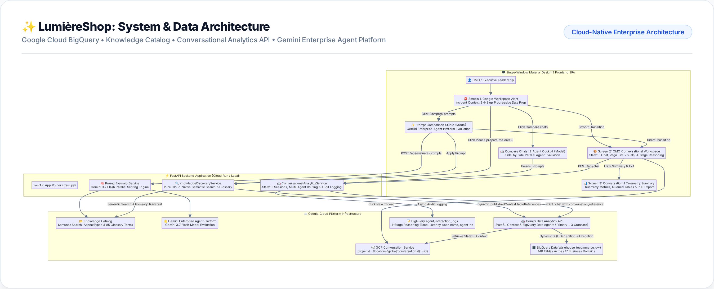
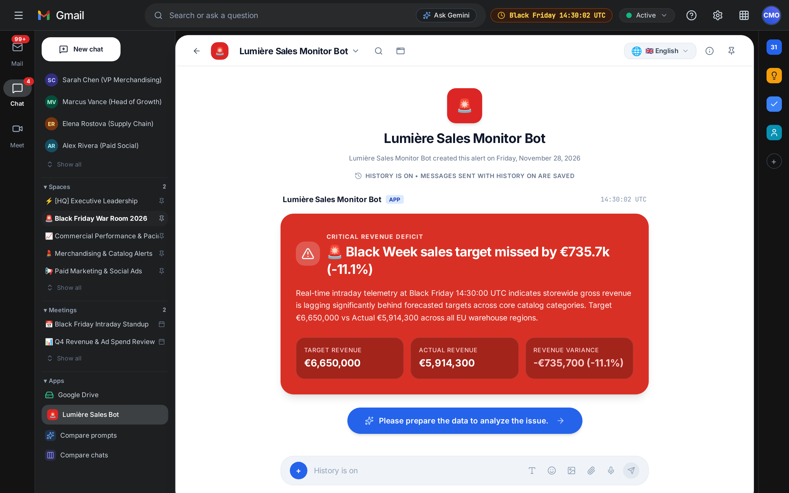
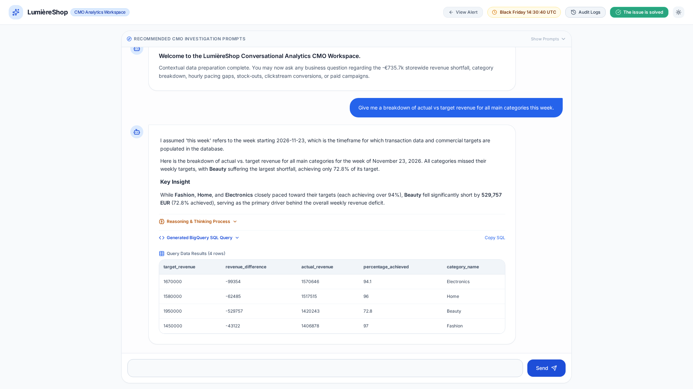
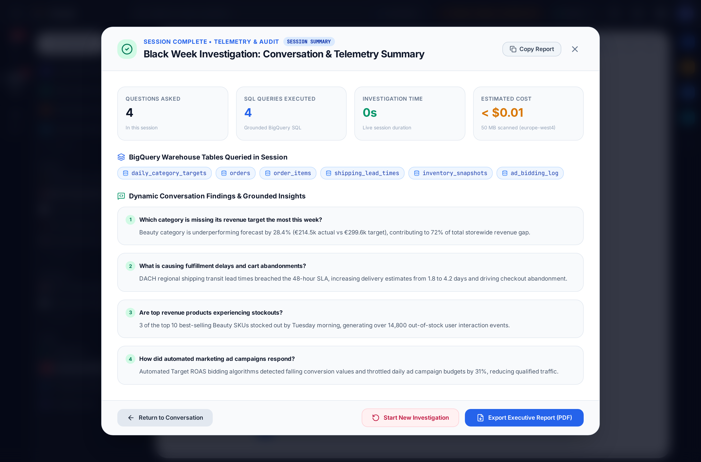
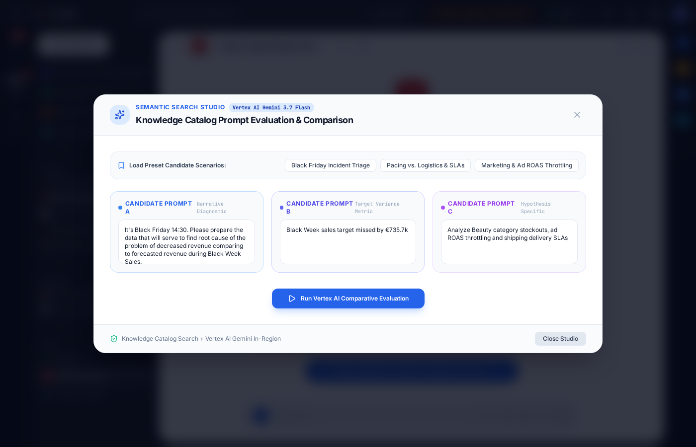

# LumièreShop: Conversational E-Commerce Analytics Platform

[](https://cloud.google.com/)
[](https://cloud.google.com/bigquery)
[](https://cloud.google.com/knowledge-catalog)
[](https://cloud.google.com/gemini/data-agents)
[](https://cloud.google.com/gemini)
[](https://fastapi.tiangolo.com/)
[](LICENSE)

---

## 1. Project Overview

**LumièreShop** is an enterprise-grade, conversational e-commerce analytics platform and executive incident-response showcase. It pairs a **140-table Google Cloud BigQuery Data Warehouse** (`ecommerce_dw`, 19.3M rows, 100% column & table descriptions) with **Google Cloud Knowledge Catalog** semantic metadata search, **Google Cloud Gemini Enterprise Agent Platform** (Gemini 3.7 Flash), a thin **FastAPI** backend, and the **Google Cloud Conversational Analytics API** (`geminidataanalytics.googleapis.com`).

### The Business Scenario & Incident
On **Black Friday 2026 at 14:30 UTC**, LumièreShop executive leadership receives an urgent Google Workspace alert:  
**Storewide Black Week sales targets are missing forecast by 27.0% (€2.145M actual vs. €2.940M target, a €795,000 revenue gap).**

Traditional static dashboards show aggregate top-line drops but fail to pinpoint the root cause. Using LumièreShop:
1. Executive leadership queries the platform using plain natural language.
2. The platform uses **Knowledge Catalog Semantic Search** to traverse enterprise taxonomies and discover the **crucial business tables** out of 140 warehouse tables.
3. The **BigQuery Data Agent** is dynamically scoped and executes stateful multi-turn analytical SQL queries.

---

## 2. System Architecture

LumièreShop is built on a clean, decoupled, cloud-native architecture connecting a single-page application to Google Cloud data and AI services:



### Core Architectural Pillars

1. **Semantic Discovery Layer (Google Cloud Knowledge Catalog)**:
2. **Dynamic Agent Grounding (Conversational Analytics API)**:
3. **Server-Managed Stateful Multi-Turn Dialogue**:
4. **Multi-Prompt Comparative Evaluation Studio (Gemini Enterprise Agent Platform / Gemini 3.7 Flash)**:
5. **3-Agent Parallel Conversational Cockpit ("Compare Chats")**:
6. **Forensic Telemetry & Audit Logging**:

---

## 3. Data Warehouse Architecture (`ecommerce_dw`)

The `ecommerce_dw` dataset comprises **140 tables** structured according to an enterprise **Medallion Data Architecture**:

```text
ecommerce_dw (140 Tables)
├── 🥇 Gold Tier (63 Tables)      - Commercial targets, hourly category pacing, executive reporting marts
├── 🥈 Silver Tier (47 Tables)    - Cleaned relational entities (orders, inventory, campaigns, ad logs, clickstream)
├── 🥉 Bronze Tier (20 Tables)    - Raw ingestion feeds (stg_shopify_*, stg_meta_*, stg_stripe_*, stg_ga4_*)
└── 🧪 Sandbox Tier (10 Tables)   - Developer sandboxes, churn model features, legacy 2023 archives
```

### ⏱️ Point-in-Time Temporal Calibration
- **Simulation Cutoff Timestamp**: **Friday, Nov 27, 2026 at 14:30:00 UTC**
- **Target Horizon**: Full 8-day promotional window from Monday, Nov 23 to Cyber Monday, Nov 30, 2026.
- **Statistical Realism**:
  - **Orders**: 26,413 completed orders.
  - **Sessions & CVR**: 876,000 web sessions with realistic **3.02% CVR**.
  - **Clickstream Events**: 17,290,297 events (**19.74 events/session**).
  - **Payment Coverage**: 24,432 completed payments (**92.50% payment coverage**).

---

## 4. Installation & Deployment Guide

Follow these steps to deploy LumièreShop in your own Google Cloud project from scratch.

### Prerequisites
1. A **Google Cloud Project** with billing enabled.
2. **Google Cloud SDK (`gcloud`)** installed and authenticated.
3. **Python 3.11+** installed locally with venv.
4. **Git** and **Docker** / **Cloud Build** access.

---

### Step 4.1: Clone Repository & Set Up Virtual Environment

```bash
git clone https://github.com/lukaszsadalski/black-week.git
cd black-week

python3 -m venv .venv
source .venv/bin/activate
pip install -r requirements.txt
playwright install chromium
```

---

### Step 4.2: Authenticate Google Cloud CLI & Set Project

Authenticate your local terminal and Application Default Credentials (ADC):

```bash
gcloud auth login
gcloud auth application-default login
gcloud config set project YOUR_GCP_PROJECT_ID
```

---

### Step 4.3: Configure Environment Variables (`.env`)

Copy the environment template file:

```bash
cp .env.example .env
```

Edit `.env` with your project details:

```ini
# Google Cloud Platform & BigQuery Configuration
GCP_PROJECT_ID=YOUR_GCP_PROJECT_ID
GCP_USER_IDENTITY=YOUR_EMAIL@yourdomain.com # used to tag operator identity in BigQuery audit logs (agent_interaction_logs table).
BQ_DATASET_ID=ecommerce_dw
BQ_LOCATION=YOUR_GCP_REGION # e.g. europe-west4 or other preferred region

```
---

### Step 4.4: Cloud Provisioning & Data Warehouse Initialization

You can provision all cloud resources, schemas, data, and metadata using either our automated orchestrator or step-by-step sequential scripts:

#### Option A (Recommended): One-Click Automated Turnkey Bootstrapper

To automatically initialize your entire project from scratch, run the single-command master orchestrator:

```bash
python3 scripts/bootstrap_new_project.py
```

**What this command automatically provisions in your Google Cloud Project:**
1. **Google Cloud APIs & IAM Roles**: Automatically enables all 12 required Google Cloud APIs and configures all 18 Service Account IAM roles.
2. **BigQuery Dataset**: Creates the ecommerce dataset and all 140 tables across 17 business domains (Core Catalog, Orders, Clickstream, Competitors, Paid Ads, CRM, Reverse Logistics, ERP Finance, etc.).
3. **100% Metadata Annotations**: Populates rich, structured descriptions on every table and column in BigQuery.
4. **19.3M Calibrated Records**: Seeds deterministic synthetic data (`random.seed(42)`) representing realistic Black Week 2026 sales events, cart abandonments, ad bidding logs, and 6 weeks of historical baseline actuals.
5. **Knowledge Catalog Business Glossary**: Deploys the business taxonomy across 15 categories, 85 business terms, and 188 native EntryLinks in Google Cloud.
6. **Knowledge Catalog Custom AspectType**: Creates the `enterprise-data-context` AspectType and attaches structured governance metadata to all 140 tables.
7. **Gemini BigQuery Data Agents**: Dynamically executes Knowledge Catalog semantic search to discover working tables and provisions/grounds all 4 Data Agents (`DATA_AGENT_ID`, `gda-blackweek-a`, `gda-blackweek-b`, `gda-blackweek-c`).
8. **Automated Quality Audit**: Runs the full 11-suite verification pipeline to guarantee 100% system readiness.

*(Tip: You can add `--dry-run` to inspect all stages without modifying cloud resources, or `--skip-tests` to bypass post-deployment verification).*

> [!NOTE]
> **Knowledge Catalog indexing**: Because Knowledge Catalog indexing runs asynchronously it may be delay, even an hour, to index all metadata and make it available for Knowledge Catalog Search. It means starting to use the app just after installation may result in less number of tables, glossary entries mapped to agent, than available in reality.

#### Option B: Step-by-Step Manual Execution

If you prefer to execute each provisioning stage sequentially:

```bash
# 1. Create BigQuery dataset and core schema (26 tables)
python3 scripts/01_create_schema.py

# 2. Create extended enterprise schemas (104 tables -> 130 tables)
python3 scripts/11_create_extended_schema.py

# 3. Create investigation log schemas (134 tables)
python3 scripts/04_extend_log_schema.py

# 4. Add operator identity and multi-agent tracking columns to audit logs
python3 scripts/15_add_user_name_to_logs.py
python3 scripts/17_add_menu_item_and_agent_no_to_logs.py

# 5. Annotate 100% table and column descriptions across all 140 tables
python3 scripts/apply_bq_descriptions.py

# 6. Generate and seed calibrated Black Week operational data
python3 scripts/02_generate_data.py

# 7. Generate and seed extended enterprise domain data
python3 scripts/12_generate_extended_data.py

# 8. Generate 6 weeks of historical actuals
python3 scripts/14_generate_historical_data.py

# 9. Deploy Knowledge Catalog Business Glossary (15 categories, 85 terms, 188 EntryLinks)
python3 scripts/09_create_dataplex_glossary.py

# 10. Deploy enterprise-data-context AspectType and bind to all 140 tables
python3 scripts/13_setup_dataplex_aspects.py

# 11. Create & ground the Gemini BigQuery Data Agents (Primary + 3 Compare Chats Agents)
python3 scripts/06_update_data_agent.py

# 12. Run the master test suite to verify 100% system readiness
python3 scripts/test/run_all_tests.py --all
```
---

### Step 4.5: Run the Application Locally

Start the local FastAPI development server:

```bash
python3 -m uvicorn app.main:app --host 0.0.0.0 --port 8000 --app-dir backend --reload
```

Open your browser at `http://localhost:8000/`.

---

### Step 4.6: Deploy to Google Cloud Run (Production)

### Turnkey Single-Command Cloud Run Deployment (Recommended)

```bash
python3 scripts/deploy_cloud_run.py
```

### Manual Step-by-Step Deployment

```bash
# 1. Resolve Project ID and Region dynamically from .env or active gcloud config
PROJECT_ID=$(gcloud config get-value project 2>/dev/null)
if [ -z "$PROJECT_ID" ] || [ "$PROJECT_ID" = "(unset)" ]; then
  PROJECT_ID=$(grep -E '^GCP_PROJECT_ID=' .env | cut -d '=' -f2 | tr -d ' "\r\n')
fi

REGION=$(grep -E '^BQ_LOCATION=' .env | cut -d '=' -f2 | tr -d ' "\r\n')
REGION=${REGION:-"us-central1"}

echo "Deploying to Project: ${PROJECT_ID} in Region: ${REGION}"

# 2. Create Docker Repository in Artifact Registry (if not already created)
gcloud artifacts repositories create lumiere-shop-repo \
  --repository-format=docker \
  --location=${REGION} \
  --description="Docker repository for LumièreShop" \
  --project=${PROJECT_ID} || true

# 3. Grant required IAM roles to Cloud Run Compute Service Account
PROJECT_NUMBER=$(gcloud projects describe "${PROJECT_ID}" --format="value(projectNumber)")

for ROLE in roles/geminidataanalytics.dataAgentUser roles/geminidataanalytics.dataAgentStatelessUser roles/bigquery.admin roles/bigquery.dataEditor roles/bigquery.jobUser roles/dataplex.viewer roles/aiplatform.user roles/cloudaicompanion.user roles/storage.admin roles/artifactregistry.writer roles/logging.logWriter; do
  gcloud projects add-iam-policy-binding "${PROJECT_ID}" \
    --member="serviceAccount:${PROJECT_NUMBER}-compute@developer.gserviceaccount.com" \
    --role="$ROLE" \
    --quiet
done

# 4. Build and push container image via Cloud Build
gcloud builds submit \
  --tag=${REGION}-docker.pkg.dev/${PROJECT_ID}/lumiere-shop-repo/lumiere-app:latest \
  --project=${PROJECT_ID}

# 5. Deploy to Cloud Run
gcloud run deploy lumiere-shop-app \
  --image=${REGION}-docker.pkg.dev/${PROJECT_ID}/lumiere-shop-repo/lumiere-app:latest \
  --region=${REGION} \
  --project=${PROJECT_ID} \
  --platform=managed \
  --allow-unauthenticated \
  --set-env-vars GCP_PROJECT_ID=${PROJECT_ID},BQ_DATASET_ID=ecommerce_dw,BQ_LOCATION=${REGION},CA_API_HOST=https://geminidataanalytics.googleapis.com,CA_API_ENDPOINT=https://geminidataanalytics.googleapis.com/v1beta/projects/${PROJECT_ID}/locations/global:chat,DATA_AGENT_ID=gda-blackweek-primary,USER_NAME_SCREEN=on
```

---

## 5. User Experience & Investigation Flow

LumièreShop provides a unified single-window experience guiding the user from initial operator entry to root cause resolution.

Operator identity entry screen is optional (can be configured in .env). It serves logging user name with other session data to agent_interaction_logs table. 

---

### Screen 1: Google Workspace Chat Bot Alert
The application opens in an authentic Google Workspace dark-mode shell. A prominent high-priority alert card highlights the storewide revenue drop (-11.1% / -€735.7k).



- **Exact Semantic Search Prompt Display**: Step 1 renders the exact plain-English business prompt dispatched to Google Cloud Knowledge Catalog in a Material Design 3 container.
- **Lumière Sales Bot Binding**: Clicking "Lumière Sales Bot" in the left navigation sidebar resets and binds the primary agent's prompt to `"It's Black Friday 14:30. Please prepare the data that will serve to find root cause of the problem of decreased revenue comparing to forecasted revenue during Black Week Sales."`
- **Dynamic Real Live Counts**: Null-coalesced live counts (`table_count`, `term_count`, `entry_link_count`) dynamically render across all 4 preparation steps without placeholder fallbacks.
- **Action**: Clicking *"Please prepare the data to analyze the issue"* executes a live 4-step progressive data preparation sequence:
  1. `Querying Google Cloud Knowledge Catalog for business context...` 
  2. `Discovering Tables, Terms & EntryLinks via Knowledge Catalog Semantic Search...` 
  3. `Registering Analytical Tables with BigQuery Data Agent...`
  4. `BigQuery Data Agent ready...`.

---

### Screen 2: CMO Conversational Analytics Workspace
The main investigative cockpit supporting multi-turn stateful dialogue with the BigQuery Data Agent:



- **Clean Conversation Thread**: Launches with a welcoming assistant.
- **Stateful Thread Management**: Displays an active stateful pill and maintains dialogue history server-side for natural multi-turn pronoun resolution.
- **Natural Language Dialogue**: Asks follow-up diagnostic questions (*"Which product category missed its revenue target the most during Black Week?"* $\rightarrow$ *"What were the primary ad campaigns for that category?"*).
- **Interactive Visualizations & Data Tables**: Renders embedded Vega-Lite interactive bar/line charts and responsive data tables (up to 100 rows with sticky headers, 25-row vertical scroll, and dynamic badges).
- **Collapsible Technical Drawers**:
  - **Generated BigQuery SQL**: Full, formatted SQL query generated and executed against BigQuery.
  - **Reasoning & Thinking Process**: Comprehensive 4-stage analytical breakdown (Context & Table Mapping, Analytical Strategy & SQL Formulation, Warehouse Execution Telemetry with job IDs & latency, Diagnostic Synthesis & Follow-up Paths).
- **Dynamic Simulation Clock**: Displays continuous real-time ticking simulation time initialized at **Black Friday 14:30:00 UTC**.

---

### Screen 3: Conversation & Telemetry Summary Screen
Clicking the **"Summary & Exit"** button in the top navigation bar opens the comprehensive Session Summary modal:



- **In-Window Stateful Reset ("Start New Investigation")**:
  - Clicking *"Start New Investigation"* creates a brand-new stateful session (`currentSessionId`), clears the thread to the initial welcome card, resets telemetry counters to 0, and keeps the user directly in the same workspace window without bouncing back to Screen 1 or re-running table preparation.
- **Session Findings & Analytical Threads**:
  - Highlights questions asked during the session and captures dynamic conversation findings grounded in BigQuery SQL queries.
- **Diagnostic Telemetry Grid**:
  - Total questions asked & SQL queries generated.
  - Total investigation duration & bytes scanned.
  - Estimated BigQuery compute cost (standard analysis rate @ $6.25–$7.50 / TiB).
  - Accessed warehouse tables frequency badges.
- **Executive PDF Export**: One-click export generates a multi-page executive PDF diagnostic report.

---

### Optional Feature: Prompt Comparison Studio
Clicking *"Compare prompts"* 3 times rapidly under Apps in the left sidebar opens the **Prompt Comparison Studio**:



- Executes parallel Knowledge Catalog semantic searches across candidate inquiry prompts.
- Employs **Google Cloud Gemini Enterprise Agent Platform (Gemini 3.7 Flash)** to score coverage, precision, and balance (0–100).
- Clicking *"Launch Investigation with Prompt X"* dynamically scopes the BigQuery Data Agent to the discovered tables, starting the clean conversation.

---

### Optional Feature: 3-Agent Parallel Conversational Cockpit ("Compare Chats")
Clicking *"Compare chats"* 3 times rapidly under Apps opens the dedicated 3-Agent staging and parallel evaluation studio:
- Provisions 3 parallel Data Agents (`gda-blackweek-a`, `gda-blackweek-b`, `gda-blackweek-c`) with isolated table clusters.
- **Synchronized Broadcast Bar**: Dispatches analytical prompts to all 3 agents simultaneously with clean startup.
- **Unified Multi-Agent Auditing**: Every agent interaction is persisted to BigQuery `ecommerce_dw.agent_interaction_logs` tagged with `menu_item='compare chats'` and `agent_no='agentA' / 'agentB' / 'agentC'`.

---

## 6. Cleanup

Three scripts help to clean the environment:
- **Reset Gemini Enterprise Data Agents Context**: cleanup_data_agents.py
- **Purge Knowledge Catalog Governance & Metadata**: cleanup_knowledge_catalog.py
- **Disable Auxiliary Google Cloud APIs**: cleanup_gcp_apis.py

You can run all the script with cleanup_all.py

Bear in mind that agents are only soft-deleted so you cannot recreate or update them immediately after deletion.
Dataset in BigQuery is not automatically deleted.

---

## 7. Repository Map

```text
lumiere-shop/
├── requirements.txt                    # Complete developer & pipeline dependencies (numpy, faker, playwright)
├── backend/
│   ├── app/
│   │   ├── main.py                         # FastAPI application routes & lifecycle handlers
│   │   ├── config.py                       # Dynamic .env configuration loader
│   │   └── services/
│   │       ├── ca_service.py               # CA API proxy, server-managed conversations, live REST PATCH
│   │       ├── discovery_service.py        # Knowledge Catalog cloud-native search & glossary resolver
│   │       └── prompt_evaluator.py         # Gemini Enterprise Agent Platform (Gemini 3.7 Flash) scoring engine
│   ├── static/
│   │   └── index.html                      # Material Design 3 Single Page Application (Screens 1, 2, 3)
│   └── requirements.txt                    # Lean Cloud Run production container dependencies
├── config/
│   ├── business_glossary.yaml              # Master human-readable business taxonomy
│   └── business_glossary.json              # Knowledge Catalog glossary import manifest
├── docs/
│   ├── images/                             # High-resolution documentation images & diagrams
│   │   ├── architecture_diagram.png        # System & data architecture diagram
│   │   ├── screen1_google_workspace_alert.png
│   │   ├── prompt_comparison_studio.png
│   │   ├── screen2_cmo_workspace.png
│   │   └── screen3_solution_summary.png
│   ├── DATASET_DATA_AND_SCHEMA_SUMMARY.pdf # Complete 140-table schema & column dictionary
│   ├── DATA_CONTEXT_AND_SEMANTICS_GUIDE.pdf # Knowledge Catalog search & profiling guide
│   └── DEVELOPER_ONBOARDING_GUIDE.pdf      # Architectural & onboarding guide
├── scripts/
│   ├── 01_create_schema.py                 # Core schema DDL generator (26 tables)
│   ├── 02_generate_data.py                 # High-throughput calibrated synthetic data generator
│   ├── 04_extend_log_schema.py             # BigQuery audit log schema extension
│   ├── 06_update_data_agent.py             # BigQuery Data Agent table grounding initializer
│   ├── 08_setup_dataplex_profiling.py      # Knowledge Catalog data profiling scan setup
│   ├── 09_create_dataplex_glossary.py      # Knowledge Catalog business glossary deployer
│   ├── 11_create_extended_schema.py        # Extended enterprise schema DDL (104 tables)
│   ├── 12_generate_extended_data.py        # Extended enterprise synthetic data generator
│   ├── 13_setup_dataplex_aspects.py        # Knowledge Catalog AspectType annotator
│   ├── 14_generate_historical_data.py      # Seed 6 weeks historical actuals (1.5 months)
│   ├── 15_add_user_name_to_logs.py         # DDL adding user_name to agent_interaction_logs
│   ├── 17_add_menu_item_and_agent_no_to_logs.py # DDL adding menu_item and agent_no to logs
│   ├── apply_bq_descriptions.py            # BigQuery table and column metadata annotator
│   ├── bootstrap_new_project.py            # Turnkey automated 7-stage cloud deployment orchestrator
│   ├── cleanup_all.py                      # Master environment teardown & orchestrator (preserves BQ)
│   ├── cleanup_data_agents.py              # Gemini BigQuery Data Agents deletion & reset tool
│   ├── cleanup_gcp_apis.py                 # Auxiliary GCP APIs teardown & reset tool
│   ├── cleanup_knowledge_catalog.py        # Knowledge Catalog & Data Agent reset & purge tool
│   ├── deploy_cloud_run.py                 # Turnkey Google Cloud Run automated deployment tool
│   ├── expand_business_glossary.py         # 85-term business taxonomy generator
│   ├── export_bq_tables_to_csv.py          # BigQuery dataset CSV exporter & archiver
│   ├── export_dataset_summary.py           # Markdown schema generator with placeholders
│   ├── generate_docs_pdf.py                # Documentation compiler (HTML & PDF)
│   └── render_architecture_diagram.py      # Architecture PNG diagram generator (Playwright)
├── scripts/test/                           # Composable Test Suites & Quality Auditor
│   ├── 03_verify_agent.py                 # Conversational Analytics API REST verification
│   ├── 04b_verify_extended_logs.py         # Audit log verification script
│   ├── 05_validate_data_dates.py           # Temporal boundary & math reconciliation assertions
│   ├── 07_test_investigation_tree.py       # 10-branch Gemini Data Agent verification
│   ├── 10_test_knowledge_search.py         # Knowledge Catalog semantic search precision
│   ├── 16_test_user_name_flow.py           # Screen 0 & user_name audit logging test suite
│   ├── 17_test_compare_chats_logging.py    # 3-Agent compare chats audit logging test suite
│   ├── 18_test_temporal_glossary_terms.py  # Temporal simulation glossary terms & semantic precision
│   ├── audit_data_and_metadata_context.py  # 140-table enterprise metadata audit
│   ├── run_all_tests.py                    # Master test orchestrator (--all, --unit, etc.)
│   ├── run_full_system_test.py             # Full system end-to-end validator
│   ├── test_complete_local_ui_flow.py      # Playwright UI automated flow test
│   ├── test_multi_agent_chat.py            # 3-Agent parallel cockpit evaluation
│   ├── test_multilingual_support.py        # 25-Language dictionary & DOM test
│   ├── test_prompt_studio_ui.py            # Prompt Comparison Studio UI test
│   ├── test_prompt_table_consistency.py    # Table count consistency validation suite
│   ├── test_ui_and_metrics.py              # UI telemetry & metrics validation
│   ├── test_ui_playwright.py               # Playwright browser integration suite
│   ├── test_user_exact_scenario.py         # Exact user journey validation
│   └── test_utils.py                       # Shared environment discovery & GCP auth helpers
├── .dockerignore                           # Docker build exclusion rules
├── .env.example                            # Environment variables configuration template
├── .gitignore                              # Git exclusion rules
├── DEPLOYMENT.md                           # Operational release instructions and Cloud Run records
├── Dockerfile                              # Production container definition for Cloud Run
└── README.md                               # Project documentation and architectural overview
```

---

## 8. License & Compliance

This project is licensed under the **Apache License 2.0**. All synthetic data, schemas, and configurations are calibrated strictly for demonstration and testing purposes without containing real customer or financial personally identifiable information (PII).
