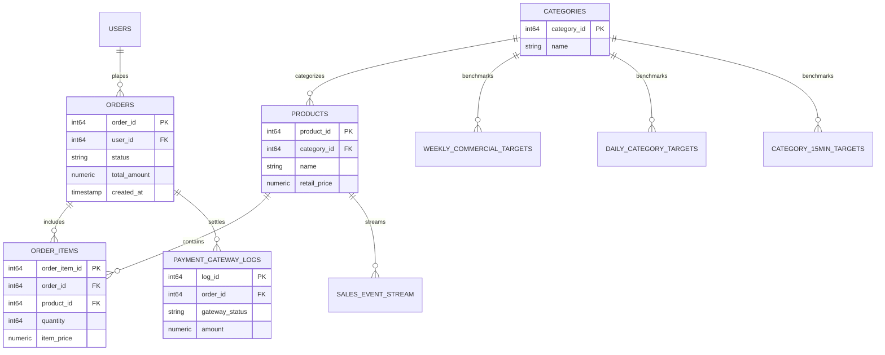
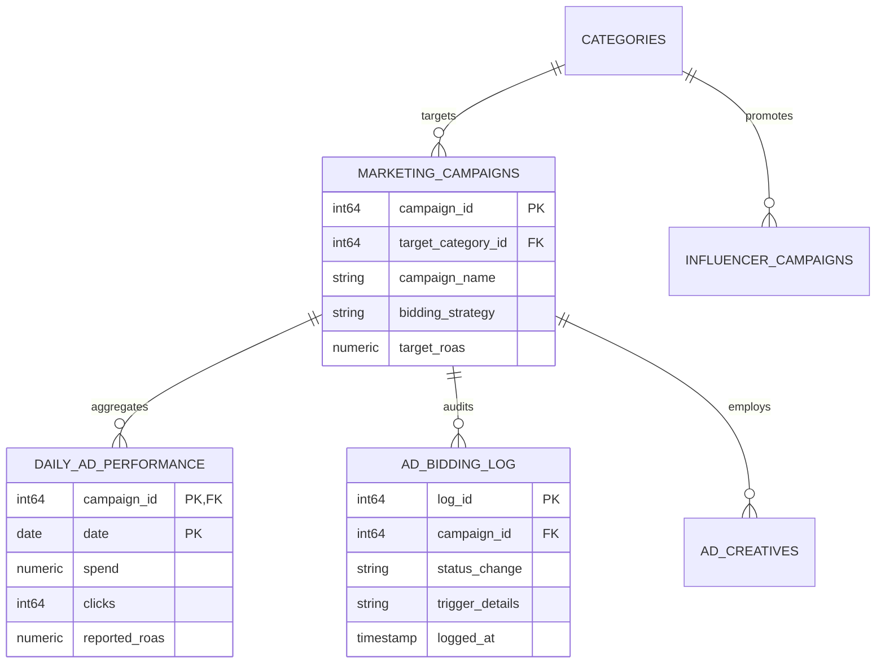
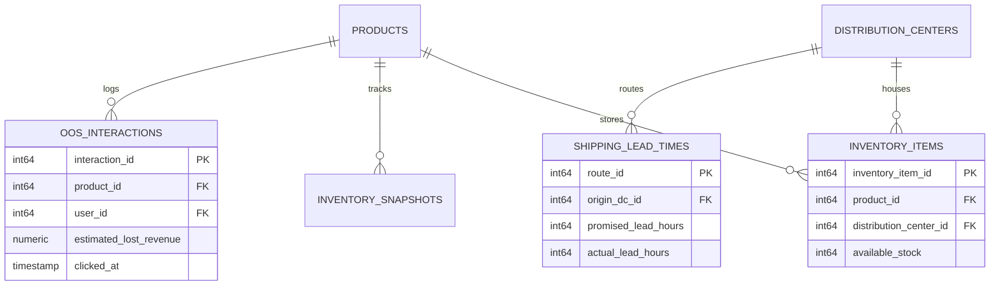

# LumièreShop: Enterprise Data Warehouse Architecture & Schema Reference

> **Dataset**: `ecommerce_dw` | **GCP Project**: `<YOUR_GCP_PROJECT_ID>` | **Location**: `<YOUR_GCP_REGION>`  
> **Scale**: **140 Tables** | **19,422,916 Total Rows** | **1,762.15 MB (1.72 GB)** Storage

---

## 📊 1. Executive Data Warehouse Summary

The LumièreShop BigQuery Data Warehouse (`ecommerce_dw`) models an omnichannel European luxury beauty and retail enterprise.
The dataset is partitioned into:
1. **Core Diagnostic Cluster (25 Tables)**: High-resolution transactional and telemetry tables powering the Black Week 2026 revenue incident root-cause discovery.
2. **Enterprise Extended Domains (115 Tables)**: Full-scope operational, accounting, logistics, marketing, machine learning, and security systems (Domains A through Q).

### 📈 Storage & Volume Breakdown by Table (All 140 Tables)

| Table Name | Record Count | Data Size | Primary Key | Operational Role & Domain |
| :--- | :---: | :---: | :--- | :--- |
| `web_events` | **17,290,297** | 1590.80 MB | `session_id` | [PURPOSE]: User interaction clickstream funnel events capturing product page views, cart additions, checkout initiations, and transaction successes for conversion funnel drop-off analysis |
| `web_sessions` | **1,716,000** | 138.00 MB | `session_id` | [PURPOSE]: Web clickstream traffic sessions recording marketing channels, UTM acquisition tags, device operating systems, browsers, and user journey attribution |
| `order_items` | **83,788** | 7.06 MB | `order_id, order_item_id` | [PURPOSE]: Discrete purchase line items recording product SKU references, realized sale prices, promotional discounts, and basket-level revenue realization |
| `sales_event_stream` | **83,788** | 7.51 MB | `event_id` | [PURPOSE]: Real-time streaming transactional event feed capturing high-frequency sales events and intra-hour intake velocity |
| `orders` | **52,365** | 3.35 MB | `order_id` | [PURPOSE]: Core transactional sales order headers capturing customer checkout completion, gross merchandise value (GMV), order status, payment confirmation, and timestamps for commercial revenue analysis |
| `payment_gateway_logs` | **51,182** | 5.13 MB | `session_id` | [PURPOSE]: Payment service provider (PSP) authorization logs capturing transaction success rates, latency in milliseconds, error codes, and checkout drop-offs across Stripe, PayPal, and Adyen |
| `inventory_snapshots` | **28,200** | 908.8 KB | `product_id, distribution_center_id, snapshot_hour` | [PURPOSE]: Daily and hourly historical inventory snapshots tracking stock depletion, stockouts, and inventory availability across warehouse hubs |
| `users` | **10,000** | 964.5 KB | `user_id` | [PURPOSE]: Customer user accounts with demographic localization, country mapping, and lifetime activity profiles |
| `email_send_queue_logs` | **5,000** | 197.7 KB | `*(Surrogate)*` | [PURPOSE]: Outbound email dispatch queue execution logs, deliverability statuses, and send timestamps |
| `stg_ga4_clickstream_raw` | **5,000** | 352.8 KB | `*(Surrogate)*` | [PURPOSE]: Raw Google Analytics 4 export event records from BigQuery streaming export |
| `stg_klaviyo_email_events_raw` | **5,000** | 727.1 KB | `event_id` | [PURPOSE]: Raw event stream from Klaviyo marketing automation webhook (opens, clicks, bounces) |
| `ticket_messages` | **5,000** | 436.0 KB | `*(Surrogate)*` | [PURPOSE]: Detailed communication thread messages exchanged between support agents and customers |
| `live_chat_messages` | **4,000** | 437.6 KB | `*(Surrogate)*` | [PURPOSE]: Individual real-time chat transcript messages exchanged during live customer chat sessions |
| `loyalty_points_ledger` | **4,000** | 222.7 KB | `*(Surrogate)*` | [PURPOSE]: Detailed transactional audit ledger recording loyalty points earned from purchases, bonus campaigns, and point expirations |
| `stg_stripe_payment_intents_raw` | **4,000** | 306.7 KB | `*(Surrogate)*` | [PURPOSE]: Raw Stripe payment intent webhook JSON payloads for credit card authorizations |
| `catalog_recommender_logs` | **3,250** | 248.8 KB | `session_id` | [PURPOSE]: On-page product recommendation widget impressions capturing algorithm fallback events, category mismatch errors, and lost substitution sales |
| `category_15min_targets` | **3,072** | 171.0 KB | `category_id, interval_start_time` | [PURPOSE]: Intraday 15-minute pacing targets modeling hourly customer traffic waves, intake velocity benchmarks, and intra-day pacing curves |
| `loyalty_members` | **2,500** | 97.7 KB | `*(Surrogate)*` | [PURPOSE]: Customer loyalty program membership profiles, reward tier standings (Silver, Gold, Platinum), and active point balances |
| `pos_transaction_items` | **2,500** | 97.7 KB | `*(Surrogate)*` | [PURPOSE]: Granular purchase line items sold through physical store cash registers |
| `push_notification_receipts` | **2,500** | 97.6 KB | `*(Surrogate)*` | [PURPOSE]: Individual mobile app push notification delivery receipts and user tap/click interactions |
| `stg_ga4_traffic_sources_raw` | **2,500** | 138.4 KB | `session_id` | [PURPOSE]: Raw GA4 traffic acquisition attribution source records |
| `stg_shopify_orders_raw` | **2,500** | 368.0 KB | `*(Surrogate)*` | [PURPOSE]: Raw Shopify webhook JSON payloads capturing e-commerce checkout and order events |
| `stg_zendesk_tickets_raw` | **2,500** | 171.7 KB | `*(Surrogate)*` | [PURPOSE]: Raw customer support ticket JSON records extracted from Zendesk Support API |
| `user_subscription_preferences` | **2,500** | 65.9 KB | `*(Surrogate)*` | [PURPOSE]: Customer communication consent settings, marketing opt-ins (email, SMS, push), and GDPR compliance timestamps |
| `product_attribute_values` | **2,000** | 72.6 KB | `*(Surrogate)*` | [PURPOSE]: EAV (Entity-Attribute-Value) structured technical product specifications and filter criteria for catalog search |
| `sms_delivery_receipts` | **2,000** | 84.0 KB | `*(Surrogate)*` | [PURPOSE]: Telecommunications carrier SMS delivery receipts and handset delivery confirmations |
| `stg_wms_shipments_raw` | **2,000** | 169.9 KB | `*(Surrogate)*` | [PURPOSE]: Raw warehouse management system (WMS) carrier dispatch manifests |
| `store_inventory_levels` | **2,000** | 78.1 KB | `*(Surrogate)*` | [PURPOSE]: Real-time store on-hand stock quantities, shelf availability, and periodic cycle count audit dates per retail location |
| `support_tickets` | **2,000** | 135.3 KB | `*(Surrogate)*` | [PURPOSE]: Customer service support cases, ticket priority, omnichannel resolution duration, and first-response metrics |
| `coupon_redemption_audit` | **1,500** | 70.3 KB | `*(Surrogate)*` | [PURPOSE]: Audit logs recording every checkout coupon code application, user ID, and monetary discount amount realized in EUR |
| `csat_surveys` | **1,500** | 85.0 KB | `*(Surrogate)*` | [PURPOSE]: Post-service customer satisfaction survey scores (1-5 scale) and verbatim feedback submitted following ticket resolution |
| `customer_refunds` | **1,500** | 87.4 KB | `*(Surrogate)*` | [PURPOSE]: Monetary refund disbursements issued to customers following verified returns, cancellations, or damaged item claims |
| `dev_customer_churn_feature_store` | **1,500** | 87.9 KB | `*(Surrogate)*` | [PURPOSE]: Machine learning feature store containing customer behavioral aggregations and predicted churn risk scores |
| `legacy_orders_2023_archive` | **1,500** | 48.4 KB | `*(Surrogate)*` | [PURPOSE]: Deprecated archive of historical 2023 customer order headers retained for legal and compliance audit |
| `live_chat_sessions` | **1,500** | 117.2 KB | `*(Surrogate)*` | [PURPOSE]: Real-time live chat sessions between web visitors and support agents, recording queue wait times and chat duration |
| `pallet_inventory_locations` | **1,500** | 71.8 KB | `*(Surrogate)*` | [PURPOSE]: Real-time pallet License Plate Number (LPN) tracking linking physical pallets to warehouse bin coordinates |
| `pos_store_transactions` | **1,500** | 91.2 KB | `*(Surrogate)*` | [PURPOSE]: In-store brick-and-mortar point-of-sale customer sales transactions, cashier employee IDs, and payment tender types |
| `product_media_gallery` | **1,500** | 124.4 KB | `*(Surrogate)*` | [PURPOSE]: High-resolution product images, video URLs, CDN asset paths, and display sort orders |
| `product_multilingual_translations` | **1,500** | 191.7 KB | `*(Surrogate)*` | [PURPOSE]: Localized product titles and marketing descriptions translated into French, German, Italian, Spanish, and Dutch |
| `product_returns` | **1,500** | 86.6 KB | `*(Surrogate)*` | [PURPOSE]: Customer post-delivery return authorizations (RMA), return reasons, processing statuses, and item condition triage for reverse logistics and refund operations |
| `return_inspections` | **1,500** | 74.7 KB | `*(Surrogate)*` | [PURPOSE]: Physical warehouse inspection triage logs evaluating item condition and restocking eligibility for returned goods |
| `return_shipping_labels` | **1,500** | 98.1 KB | `*(Surrogate)*` | [PURPOSE]: Logistics return shipping waybills and tracking records generated for customer merchandise returns |
| `stg_shopify_customers_raw` | **1,500** | 157.7 KB | `*(Surrogate)*` | [PURPOSE]: Raw Shopify customer account update webhook JSON payloads |
| `stg_zendesk_satisfaction_raw` | **1,500** | 77.0 KB | `*(Surrogate)*` | [PURPOSE]: Raw customer satisfaction rating survey responses from Zendesk |
| `purchase_order_line_items` | **1,200** | 56.2 KB | `*(Surrogate)*` | [PURPOSE]: Itemized procurement line items specifying ordered quantities, received quantities, and unit wholesale costs in EUR |
| `qa_load_test_sessions_backup` | **1,200** | 57.5 KB | `*(Surrogate)*` | [PURPOSE]: Archived load test benchmark traffic logs generated by synthetic load testing tools |
| `stg_sap_erp_inventory_feed_raw` | **1,200** | 66.9 KB | `*(Surrogate)*` | [PURPOSE]: Raw nightly inventory stock feed export from SAP ERP enterprise system |
| `stg_shopify_products_raw` | **1,200** | 136.7 KB | `*(Surrogate)*` | [PURPOSE]: Raw Shopify product synchronization JSON payloads from catalog webhooks |
| `oos_interactions` | **1,182** | 51.8 KB | `interaction_id` | [PURPOSE]: Customer browsing and cart interactions on out-of-stock items, capturing unfulfilled demand and estimated lost revenue in EUR due to inventory stockouts |
| `forklift_telemetry_logs` | **600** | 23.4 KB | `*(Surrogate)*` | [PURPOSE]: Material handling equipment (forklift) IoT telemetry, battery state of charge, odometer readings, and maintenance alerts |
| `inventory_items` | **600** | 28.1 KB | `inventory_item_id` | [PURPOSE]: Real-time master stock allocations, safety stock warning thresholds, and warehouse batch availability tracking across distribution centers |
| `loyalty_reward_redemptions` | **600** | 27.5 KB | `*(Surrogate)*` | [PURPOSE]: Member reward redemption events converting accumulated loyalty points into discount vouchers or merchandise gifts |
| `products` | **600** | 45.5 KB | `product_id` | [PURPOSE]: Master catalog of all retail products, default selling prices, cost of goods, brands, and category mappings for commercial intake tracking |
| `referral_program_invites` | **600** | 33.7 KB | `*(Surrogate)*` | [PURPOSE]: Customer referral invitation tracking, unique referral links, and recipient invitation delivery logs |
| `stg_google_ads_search_terms_raw` | **600** | 40.7 KB | `*(Surrogate)*` | [PURPOSE]: Raw Google Search Ads query term performance extracts |
| `supplier_lead_time_history` | **600** | 28.1 KB | `*(Surrogate)*` | [PURPOSE]: Historical supplier manufacturing and transit lead times comparing promised days vs actual delivery dates |
| `competitor_price_feed` | **500** | 22.9 KB | `*(Surrogate)*` | [PURPOSE]: Daily competitor retail pricing scrapes benchmarking price parity indices, market elasticity, and competitor price movements |
| `knowledge_base_articles` | **300** | 28.9 KB | `*(Surrogate)*` | [PURPOSE]: Help center self-service FAQ articles, view counts, and customer helpfulness voting metrics |
| `legacy_products_deprecated` | **300** | 15.4 KB | `*(Surrogate)*` | [PURPOSE]: Discontinued catalog products and end-of-life merchandise from previous retail seasons |
| `qa_checkout_synthetic_fuzz_tests` | **300** | 11.9 KB | `*(Surrogate)*` | [PURPOSE]: Automated checkout synthetic fuzz testing payloads and HTTP response code validations |
| `replacement_orders` | **300** | 14.9 KB | `*(Surrogate)*` | [PURPOSE]: Zero-cost replacement orders dispatched to customers for lost, defective, or incorrect shipments |
| `stg_sap_erp_purchase_orders_raw` | **300** | 21.5 KB | `*(Surrogate)*` | [PURPOSE]: Raw SAP ERP procurement purchase order dumps |
| `stg_stripe_disputes_raw` | **300** | 18.4 KB | `*(Surrogate)*` | [PURPOSE]: Raw Stripe credit card chargeback disputes and inquiry logs |
| `test_carrier_webhook_payloads` | **300** | 31.3 KB | `*(Surrogate)*` | [PURPOSE]: Synthetic logistics carrier webhook testing fixtures for development mocking and contract verification |
| `test_fraud_mock_transactions` | **300** | 7.5 KB | `*(Surrogate)*` | [PURPOSE]: Synthetic fraud model test transactions evaluating rule triggers and mock transaction risks |
| `agent_interaction_logs` | **281** | 1.41 MB | `interaction_id` | [PURPOSE]: Conversational Analytics session audit logs recording natural language prompts, generated SQL queries, latency, and token execution costs |
| `gl_journal_lines` | **250** | 9.3 KB | `*(Surrogate)*` | [PURPOSE]: Granular debit and credit line item postings mapped to chart of accounts codes for general ledger reconciliation |
| `accounts_payable_invoices` | **200** | 13.1 KB | `*(Surrogate)*` | [PURPOSE]: Vendor accounts payable (AP) commercial invoices, invoice amounts in EUR, payment due dates, and approval statuses |
| `customs_and_duties_declarations` | **200** | 10.2 KB | `*(Surrogate)*` | [PURPOSE]: International import customs declarations, Harmonized System (HS) tariff codes, and paid import duty amounts in EUR |
| `daily_category_targets` | **200** | 16.7 KB | `category_id, date` | [PURPOSE]: Intra-week daily pacing targets, budget allocations, expected conversion rates, and commercial revenue quotas per category for daily sales pacing and revenue deficit root cause investigations |
| `referral_reward_claims` | **200** | 7.8 KB | `*(Surrogate)*` | [PURPOSE]: Referral rewards credited to advocating customers upon successful order completion by referred friends |
| `store_employee_rosters` | **200** | 10.6 KB | `*(Surrogate)*` | [PURPOSE]: In-store retail employee staffing rosters, shift schedules, and operational store roles (Cashier, Floor Supervisor) |
| `warranty_claims` | **200** | 12.5 KB | `*(Surrogate)*` | [PURPOSE]: Customer warranty claims, defect reports, manufacturer claim filings, and resolution triage |
| `daily_ad_performance` | **173** | 10.8 KB | `campaign_id, date` | [PURPOSE]: Daily marketing performance tracking impressions, clicks, advertising spend in EUR, attributed conversions, average CPC, and ROAS efficiency |
| `warehouse_aisles_and_racks` | **160** | 7.0 KB | `*(Surrogate)*` | [PURPOSE]: Storage bin locations, aisle coordinates, vertical rack levels, and maximum weight capacity limits |
| `accounts_payable_disbursements` | **150** | 6.3 KB | `*(Surrogate)*` | [PURPOSE]: Outbound cash disbursement payments executed to settle vendor accounts payable invoices |
| `call_center_recordings_metadata` | **150** | 13.0 KB | `*(Surrogate)*` | [PURPOSE]: Inbound telephony call records, interactive voice response (IVR) menu traversal, call duration, and customer phone hashes |
| `cross_dock_transfer_orders` | **150** | 8.2 KB | `*(Surrogate)*` | [PURPOSE]: Inter-hub inventory transfer shipments moving stock between regional distribution centers across Europe |
| `dev_product_embedding_vectors` | **150** | 13.3 KB | `*(Surrogate)*` | [PURPOSE]: Product catalog semantic embedding vector embeddings for experimental visual similarity models |
| `email_bounces_and_complaints` | **150** | 6.5 KB | `*(Surrogate)*` | [PURPOSE]: Hard/soft email bounce records, spam complaints, and invalid email addresses for sender reputation management |
| `nps_feedback_responses` | **150** | 9.7 KB | `*(Surrogate)*` | [PURPOSE]: Relationship Net Promoter Score (NPS) surveys measuring overall customer brand loyalty and willingness to recommend |
| `restocking_fee_logs` | **150** | 4.7 KB | `*(Surrogate)*` | [PURPOSE]: Restocking fee deductions applied to customer return refunds for out-of-policy returns or bulky freight items |
| `stg_meta_ad_insights_raw` | **150** | 9.2 KB | `*(Surrogate)*` | [PURPOSE]: Raw Meta Marketing API adset insights JSON feeds |
| `supplier_quality_scorecards` | **150** | 7.2 KB | `*(Surrogate)*` | [PURPOSE]: Monthly supplier performance evaluation scorecards tracking On-Time In-Full (OTIF %) delivery and defect rates |
| `suppliers_master` | **150** | 7.5 KB | `*(Surrogate)*` | [PURPOSE]: Global product manufacturer and wholesale supplier master profiles, country codes, payment terms, and active contract status |
| `customer_escalations` | **125** | 8.9 KB | `*(Surrogate)*` | [PURPOSE]: High-priority customer escalations handled by management, documenting root cause reason and financial goodwill concessions in EUR |
| `general_ledger_journal_entries` | **125** | 12.6 KB | `*(Surrogate)*` | [PURPOSE]: Official enterprise general ledger accounting journal header entries recording double-entry bookkeeping debits and credits for monthly corporate financial closes |
| `stg_google_ads_campaigns_raw` | **125** | 10.1 KB | `*(Surrogate)*` | [PURPOSE]: Raw Google Ads campaign performance reporting extracts |
| `stg_klaviyo_campaigns_raw` | **125** | 9.0 KB | `*(Surrogate)*` | [PURPOSE]: Raw email campaign configuration dumps from Klaviyo REST API |
| `support_agents` | **125** | 5.9 KB | `*(Surrogate)*` | [PURPOSE]: Customer support representative profiles, tier rankings, language capabilities, and assigned shift schedules |
| `gift_card_transactions` | **120** | 4.7 KB | `*(Surrogate)*` | [PURPOSE]: Individual debit and top-up transactions charged against customer gift card balances during checkout |
| `accounts_receivable_invoices` | **100** | 5.2 KB | `*(Surrogate)*` | [PURPOSE]: B2B corporate client billing invoices, accounts receivable balances, credit terms, and payment settlement tracking |
| `affiliate_commission_payouts` | **100** | 4.1 KB | `*(Surrogate)*` | [PURPOSE]: Monthly affiliate publisher commission calculations, attributed sales volume in EUR, and payout approval records |
| `affiliate_publishers_directory` | **100** | 5.0 KB | `*(Surrogate)*` | [PURPOSE]: Third-party affiliate publisher networks, promotional partners, and contracted commission rates |
| `stg_criteo_retargeting_raw` | **100** | 4.7 KB | `*(Surrogate)*` | [PURPOSE]: Raw Criteo dynamic product retargeting daily performance reporting |
| `store_cash_drawer_counts` | **100** | 4.7 KB | `*(Surrogate)*` | [PURPOSE]: Daily store register cash drawer end-of-shift balancing logs and physical cash counting variances in EUR |
| `shipping_lead_times` | **94** | 9.6 KB | `*(Surrogate)*` | [PURPOSE]: Fulfillment center operational metrics, carrier workload, promised delivery SLAs, and delivery delay impacts on cart abandonment and conversion |
| `click_and_collect_orders` | **80** | 4.1 KB | `*(Surrogate)*` | [PURPOSE]: Buy Online Pick Up in Store (BOPIS) orders, store pickup verification PINs, customer collection timestamps, and fulfillment states |
| `gift_card_master` | **80** | 4.9 KB | `*(Surrogate)*` | [PURPOSE]: Electronic and physical gift card registry, initial balances in EUR, current remaining balances, and activation states |
| `inbound_dock_appointments` | **80** | 4.8 KB | `*(Surrogate)*` | [PURPOSE]: Warehouse inbound freight dock door appointment schedules, carrier arrival timestamps, and trailer unloading durations |
| `sandbox_dynamic_pricing_sim_v1` | **80** | 3.1 KB | `*(Surrogate)*` | [PURPOSE]: Offline dynamic pricing simulator sandbox estimating price elasticity curves and revenue trade-offs |
| `stg_trustpilot_reviews_raw` | **80** | 10.2 KB | `*(Surrogate)*` | [PURPOSE]: Raw Trustpilot public customer review feed webhooks |
| `store_credit_issuances` | **80** | 3.8 KB | `*(Surrogate)*` | [PURPOSE]: Store credit ledger records, customer credit balances, and credit expiration tracking |
| `agent_worklog_shifts` | **75** | 3.1 KB | `*(Surrogate)*` | [PURPOSE]: Daily customer support agent productivity records, tickets resolved, and average handle time (AHT) in seconds |
| `purchase_orders` | **60** | 3.4 KB | `*(Surrogate)*` | [PURPOSE]: Commercial procurement purchase order headers issued to product suppliers with contractual delivery deadlines and values in EUR |
| `sandbox_search_ranking_ab_test` | **60** | 3.5 KB | `*(Surrogate)*` | [PURPOSE]: Search ranking algorithm A/B experiment evaluation logs recording NDCG@10 relevance scores |
| `warehouse_labor_shifts` | **60** | 3.4 KB | `*(Surrogate)*` | [PURPOSE]: Warehouse worker labor shift schedules, picking tasks completed, and units picked per hour for logistics fulfillment |
| `warehouse_refurbishments` | **60** | 3.0 KB | `*(Surrogate)*` | [PURPOSE]: Refurbishment work orders, technician labor hours, and replacement parts costs for returned open-box electronics |
| `weekly_commercial_targets` | **28** | 1.3 KB | `category_id, week_start_date` | [PURPOSE]: Executive commercial financial planning benchmarks, expected visitor sessions, target revenue in EUR, and conversion rate (CVR) goals by product category and calendar week for sales target tracking and target deficit analysis |
| `ad_bidding_log` | **27** | 3.0 KB | `log_id` | [PURPOSE]: Automated ad platform bidding engine telemetry capturing target ROAS constraints, budget throttling events, and algorithmic learning phase status |
| `currency_exchange_rates_daily` | **20** | 0.6 KB | `*(Surrogate)*` | [PURPOSE]: Daily foreign currency exchange rates benchmarking EUR against USD, GBP, CHF, and other major trading currencies |
| `chart_of_accounts` | **10** | 0.4 KB | `*(Surrogate)*` | [PURPOSE]: Master general ledger chart of accounts defining corporate asset, liability, equity, revenue, and expense account codes |
| `vat_period_filing_reports` | **7** | 0.3 KB | `*(Surrogate)*` | [PURPOSE]: Periodic statutory VAT tax return filings summarizing taxable sales revenue and collected output VAT across European jurisdictions |
| `vat_tax_jurisdictions` | **7** | 0.2 KB | `*(Surrogate)*` | [PURPOSE]: Master European Value Added Tax (VAT) rate tables across European destination countries and standard/reduced rate categories |
| `ad_creatives` | **5** | 0.4 KB | `*(Surrogate)*` | [PURPOSE]: Creative asset performance tracking creative fatigue, quality scores, click-through rates, and learning-limited states impacting ad delivery |
| `bank_account_reconciliation` | **5** | 0.3 KB | `*(Surrogate)*` | [PURPOSE]: Monthly corporate bank account balance reconciliations comparing statement ending balances against general ledger cash |
| `pos_terminal_registers` | **5** | 0.2 KB | `*(Surrogate)*` | [PURPOSE]: Point of Sale (POS) checkout terminal registers, hardware models, serial numbers, and IP address bindings |
| `return_reasons_lookup` | **5** | 0.2 KB | `*(Surrogate)*` | [PURPOSE]: Standardized catalog of customer return reason codes, policy categories, and evidence requirements |
| `stg_adyen_settlements_raw` | **5** | 0.3 KB | `*(Surrogate)*` | [PURPOSE]: Raw daily settlement payout reports from Adyen payment platform |
| `ticket_categories` | **5** | 0.2 KB | `*(Surrogate)*` | [PURPOSE]: Classification taxonomy of customer support issue types and target resolution SLA targets in minutes |
| `categories` | **4** | 0.1 KB | `*(Surrogate)*` | [PURPOSE]: Master product category taxonomy with hierarchical parent references for merchandising and commercial sales reporting |
| `category_hierarchy_paths` | **4** | 0.1 KB | `*(Surrogate)*` | [PURPOSE]: Materialized category hierarchy breadcrumb paths for fast e-commerce storefront navigation and facet filtering |
| `competitor_promotions` | **4** | 0.4 KB | `*(Surrogate)*` | [PURPOSE]: Scraped competitor retail promotional campaigns, discount depths, promotional banners, and relative price parity benchmarking data |
| `discount_coupons_master` | **4** | 0.3 KB | `*(Surrogate)*` | [PURPOSE]: Marketing promotional coupon codes, percentage discount values, minimum order thresholds, and expiration dates |
| `loyalty_tier_definitions` | **4** | 0.1 KB | `*(Surrogate)*` | [PURPOSE]: Loyalty program tier qualification rules, annual spend thresholds in EUR, and promotional point earning multipliers |
| `marketing_campaigns` | **4** | 0.3 KB | `*(Surrogate)*` | [PURPOSE]: Paid digital marketing campaign configurations across Meta Ads and Google Ads with target ROAS, target CPA, and bidding strategy definitions |
| `payment_gateway_fee_schedules` | **4** | 0.2 KB | `*(Surrogate)*` | [PURPOSE]: Contracted merchant interchange fee percentages and fixed per-transaction processing fees across Stripe, PayPal, and Adyen |
| `physical_store_locations` | **4** | 0.3 KB | `*(Surrogate)*` | [PURPOSE]: Master directory of brick-and-mortar retail stores, address geolocations, floor square meters, and opening status |
| `product_attribute_definitions` | **4** | 0.2 KB | `*(Surrogate)*` | [PURPOSE]: Master Product Information Management (PIM) attribute definitions (e |
| `warehouse_zones` | **4** | 0.2 KB | `*(Surrogate)*` | [PURPOSE]: Warehouse physical floor zones (e |
| `email_campaign_templates` | **3** | 0.4 KB | `*(Surrogate)*` | [PURPOSE]: Marketing email templates, subject line A/B test variations, and creative layouts for automated CRM lifecycle journeys |
| `freight_carrier_contracts` | **3** | 0.2 KB | `*(Surrogate)*` | [PURPOSE]: Master freight carrier commercial service contracts, contracted base rates per kilogram, and fuel surcharge formulas |
| `influencer_campaigns` | **3** | 0.3 KB | `*(Surrogate)*` | [PURPOSE]: Creator marketing performance tracking sponsored content views, promo code redemptions, target vs actual revenue quotas, and creator fees |
| `product_brand_guidelines` | **3** | 0.1 KB | `*(Surrogate)*` | [PURPOSE]: Manufacturer minimum advertised price (MAP) policies, brand authorization rules, and trademark guidelines |
| `product_size_charts` | **3** | 0.1 KB | `*(Surrogate)*` | [PURPOSE]: Category size conversion tables, body measurements in centimeters, and international size mapping |
| `distribution_centers` | **2** | 0.1 KB | `*(Surrogate)*` | [PURPOSE]: Regional fulfillment centers and warehouse logistics hubs managing physical inventory and order dispatch across Europe |
| `intercompany_transfer_pricing` | **2** | 0.2 KB | `*(Surrogate)*` | [PURPOSE]: Cross-border intercompany transfer pricing schedules and cost-plus markup percentages between European corporate subsidiaries |
| `mobile_app_push_campaigns` | **2** | 0.2 KB | `*(Surrogate)*` | [PURPOSE]: Mobile app push notification broadcasts, rich media titles, and deep link targets for iOS/Android apps |
| `seo_meta_tags_registry` | **2** | 0.4 KB | `*(Surrogate)*` | [PURPOSE]: Search engine optimization (SEO) title tags, meta descriptions, and canonical URLs across all web catalog pages |
| `sms_marketing_broadcasts` | **2** | 0.3 KB | `*(Surrogate)*` | [PURPOSE]: SMS text marketing campaign broadcasts, promotional message copy, and targeted customer cohort segments |

---

## 🗺️ 2. Core Relational Architecture Diagrams

The following Mermaid diagrams illustrate the physical foreign key linkages across the core operational clusters:

### 💳 A. Commercial Revenue & Order Transaction Flow

### 📢 B. Paid Advertising & Automated Bidding Engine

### 📦 C. Supply Chain Stockouts & Fulfillment

---

## 🎯 3. Core Investigation Tables Deep-Dive (25 Tables)

Detailed column schemas, primary keys, foreign keys, and exact record counts for all 25 tables in the core diagnostic cluster:

### 📋 `weekly_commercial_targets`
- **Business Meaning**: [PURPOSE]: Executive commercial financial planning benchmarks, expected visitor sessions, target revenue in EUR, and conversion rate (CVR) goals by product category and calendar week for sales target tracking and target deficit analysis. [DOMAIN]: Domain B: Commercial Pacing Targets. [GRAIN]: One row per product category per calendar week (target_id). [TIER & REFRESH]: GOLD_CURATED | Pre-Season Financial Benchmark. [DIAGNOSTIC ROLE]: Incident Benchmark - Executive Commercial Sales Quotas and Target Deficit Baseline.
- **Record Count**: **28 rows** (1.3 KB)
- **Primary Key (PK)**: `category_id + week_start_date`
- **Foreign Keys (FK)**: target_id ➔ `targets.target_id`

| Column Name | Data Type | Field Meaning & Calculation Formula |
| :--- | :--- | :--- |
| `category_id` | `INT64` | Foreign key to categories table |
| `target_conversion_rate` | `FLOAT64` | Target e-commerce conversion rate (CVR) |
| `target_id` | `INT64` | Commercial target identifier (Primary Key) |
| `target_revenue` | `FLOAT64` | Total planned commercial revenue target in EUR |
| `target_sessions` | `INT64` | Expected web traffic sessions |
| `week_start_date` | `DATE` | Target week start date (2026-11-23) |

### 📋 `daily_category_targets`
- **Business Meaning**: [PURPOSE]: Intra-week daily pacing targets, budget allocations, expected conversion rates, and commercial revenue quotas per category for daily sales pacing and revenue deficit root cause investigations. [DOMAIN]: Domain B: Commercial Pacing Targets. [GRAIN]: One row per category per calendar day (target_id). [TIER & REFRESH]: GOLD_CURATED | Daily Benchmark. [DIAGNOSTIC ROLE]: Incident Benchmark - Daily Target Pacing, Planned CVR & ROAS Expectations.
- **Record Count**: **200 rows** (16.7 KB)
- **Primary Key (PK)**: `category_id + date`
- **Foreign Keys (FK)**: target_id ➔ `targets.target_id`

| Column Name | Data Type | Field Meaning & Calculation Formula |
| :--- | :--- | :--- |
| `category_id` | `INT64` | Foreign key to categories table |
| `date` | `DATE` | Target calendar date (2026-11-23 to 2026-11-30) |
| `target_ad_spend` | `FLOAT64` | Allocated paid marketing ad spend budget in EUR |
| `target_aov` | `FLOAT64` | Expected average order value in EUR |
| `target_conversion_rate` | `FLOAT64` | Expected conversion rate benchmark |
| `target_id` | `STRING` | Daily target identifier (Primary Key) |
| `target_revenue` | `FLOAT64` | Daily planned category revenue in EUR |
| `target_roas` | `FLOAT64` | Target return on ad spend multiplier benchmark |
| `target_sessions` | `INT64` | Daily planned web session traffic target |

### 📋 `category_15min_targets`
- **Business Meaning**: [PURPOSE]: Intraday 15-minute pacing targets modeling hourly customer traffic waves, intake velocity benchmarks, and intra-day pacing curves. [DOMAIN]: Domain B: Commercial Pacing Targets. [GRAIN]: One row per category per 15-minute time window (target_id). [TIER & REFRESH]: GOLD_CURATED | Intraday Curve Benchmark. [DIAGNOSTIC ROLE]: Incident Benchmark - Intraday Hourly Intake Velocity Curves.
- **Record Count**: **3,072 rows** (171.0 KB)
- **Primary Key (PK)**: `category_id + interval_start_time`
- **Foreign Keys (FK)**: target_id ➔ `targets.target_id`

| Column Name | Data Type | Field Meaning & Calculation Formula |
| :--- | :--- | :--- |
| `category_id` | `INT64` | Foreign key to categories table |
| `day_of_week` | `INT64` | Day of week integer (1=Sunday..7=Saturday) |
| `target_id` | `STRING` | 15-minute pacing target identifier (Primary Key) |
| `target_revenue` | `FLOAT64` | Planned revenue target for the 15-minute interval in EUR |
| `target_sessions` | `INT64` | Planned web sessions traffic for the interval |
| `time_bucket` | `TIME` | 15-minute time bucket |

### 📋 `categories`
- **Business Meaning**: [PURPOSE]: Master product category taxonomy with hierarchical parent references for merchandising and commercial sales reporting. [DOMAIN]: Domain A: Core Commerce Catalog. [GRAIN]: One row per product category (category_id). [TIER & REFRESH]: GOLD_CURATED | Batch Daily @ 01:00 UTC. [DIAGNOSTIC ROLE]: Incident Dimension - Category Hierarchy & Pacing Target Partitioning.
- **Record Count**: **4 rows** (0.1 KB)
- **Primary Key (PK)**: `None`
- **Foreign Keys (FK)**: category_id ➔ `categories.category_id`, parent_category_id ➔ `parent_categorys.parent_category_id`

| Column Name | Data Type | Field Meaning & Calculation Formula |
| :--- | :--- | :--- |
| `category_id` | `INT64` | Unique identifier for the product category (Primary Key) |
| `name` | `STRING` | Display name of the category (e.g., Beauty, Electronics, Fashion, Home) |
| `parent_category_id` | `STRING` | Self-referencing link to parent category for hierarchy |
| `slug` | `STRING` | URL-safe slug text string |

### 📋 `products`
- **Business Meaning**: [PURPOSE]: Master catalog of all retail products, default selling prices, cost of goods, brands, and category mappings for commercial intake tracking. [DOMAIN]: Domain A: Core Commerce Catalog. [GRAIN]: One row per distinct product SKU (product_id). [TIER & REFRESH]: GOLD_CURATED | Batch Daily @ 01:00 UTC. [DIAGNOSTIC ROLE]: Incident Dimension - SKU Metadata, Unit Economics & Margin Diagnostics.
- **Record Count**: **600 rows** (45.5 KB)
- **Primary Key (PK)**: `product_id`
- **Foreign Keys (FK)**: category_id ➔ `categories.category_id`

| Column Name | Data Type | Field Meaning & Calculation Formula |
| :--- | :--- | :--- |
| `brand` | `STRING` | Brand or manufacturer name |
| `category_id` | `INT64` | Foreign key to categories table |
| `cost` | `FLOAT64` | Acquisition and production cost in EUR |
| `is_active` | `BOOL` | Catalog visibility flag |
| `name` | `STRING` | Full retail product name |
| `product_id` | `INT64` | Unique master identifier for the product (Primary Key) |
| `retail_price` | `FLOAT64` | Default selling price in EUR |
| `sku` | `STRING` | Stock Keeping Unit code |

### 📋 `orders`
- **Business Meaning**: [PURPOSE]: Core transactional sales order headers capturing customer checkout completion, gross merchandise value (GMV), order status, payment confirmation, and timestamps for commercial revenue analysis. [DOMAIN]: Domain B: Transactions & Target Curves. [GRAIN]: One row per checkout order header (order_id). [TIER & REFRESH]: GOLD_CURATED | Real-Time Streaming. [DIAGNOSTIC ROLE]: Incident Primary Metric - Realized Actual Sales Revenue Baseline & Shortfall vs Planned Financial Quotas.
- **Record Count**: **52,365 rows** (3.35 MB)
- **Primary Key (PK)**: `order_id`
- **Foreign Keys (FK)**: user_id ➔ `users.user_id`

| Column Name | Data Type | Field Meaning & Calculation Formula |
| :--- | :--- | :--- |
| `created_at` | `TIMESTAMP` | Transaction execution timestamp |
| `num_of_items` | `INT64` | Total physical items count in order |
| `order_id` | `INT64` | Transaction header identifier (Primary Key) |
| `order_status` | `STRING` | Operational status (Completed, Processing, Cancelled) |
| `shipping_fee` | `FLOAT64` | Shipping delivery fee billed in EUR |
| `tax_amount` | `FLOAT64` | VAT tax portion of transaction in EUR |
| `total_amount` | `FLOAT64` | Total gross purchase price in EUR |
| `user_id` | `INT64` | Foreign key to users table |

### 📋 `order_items`
- **Business Meaning**: [PURPOSE]: Discrete purchase line items recording product SKU references, realized sale prices, promotional discounts, and basket-level revenue realization. [DOMAIN]: Domain B: Transactions & Target Curves. [GRAIN]: One row per purchased item line (order_item_id). [TIER & REFRESH]: GOLD_CURATED | Real-Time Streaming. [DIAGNOSTIC ROLE]: Incident Primary Metric - Category & SKU Revenue Contribution Breakdown.
- **Record Count**: **83,788 rows** (7.06 MB)
- **Primary Key (PK)**: `order_id + order_item_id`
- **Foreign Keys (FK)**: inventory_item_id ➔ `inventory_items.inventory_item_id`, product_id ➔ `products.product_id`, user_id ➔ `users.user_id`

| Column Name | Data Type | Field Meaning & Calculation Formula |
| :--- | :--- | :--- |
| `created_at` | `TIMESTAMP` | Line item creation timestamp |
| `delivered_at` | `TIMESTAMP` | Customer delivery confirmation timestamp |
| `discount_amount` | `FLOAT64` | Promotional discount applied in EUR |
| `inventory_item_id` | `INT64` | Foreign key to inventory_items table |
| `order_id` | `INT64` | Foreign key to orders table |
| `order_item_id` | `INT64` | Transaction line item identifier (Primary Key) |
| `product_id` | `INT64` | Foreign key to products table |
| `quantity` | `INT64` | Quantity of product units purchased |
| `returned_at` | `TIMESTAMP` | Customer return receipt timestamp |
| `sale_price` | `FLOAT64` | Captured unit selling price at checkout in EUR |
| `shipped_at` | `TIMESTAMP` | Logistics carrier dispatch timestamp |
| `user_id` | `INT64` | Foreign key to users table |

### 📋 `sales_event_stream`
- **Business Meaning**: [PURPOSE]: Real-time streaming transactional event feed capturing high-frequency sales events and intra-hour intake velocity. [DOMAIN]: Domain B: Transactions & Target Curves. [GRAIN]: One row per real-time purchase event (event_id). [TIER & REFRESH]: GOLD_CURATED | Streaming Event-Driven (<1s). [DIAGNOSTIC ROLE]: Incident Velocity - Real-Time Sales Rate & Intra-Hour Deficit Monitoring.
- **Record Count**: **83,788 rows** (7.51 MB)
- **Primary Key (PK)**: `event_id`
- **Foreign Keys (FK)**: category_id ➔ `categories.category_id`, order_id ➔ `orders.order_id`, product_id ➔ `products.product_id`

| Column Name | Data Type | Field Meaning & Calculation Formula |
| :--- | :--- | :--- |
| `category_id` | `INT64` | Foreign key to categories table |
| `discount_amount` | `FLOAT64` | Promotional discount deducted in EUR |
| `event_id` | `STRING` | Streaming event UUID identifier (Primary Key) |
| `order_id` | `INT64` | Foreign key to orders table |
| `product_id` | `INT64` | Foreign key to products table |
| `quantity` | `INT64` | Count of units sold |
| `sale_price` | `FLOAT64` | Captured base unit price in EUR |
| `timestamp` | `TIMESTAMP` | Real-time streaming ingestion timestamp |

### 📋 `inventory_items`
- **Business Meaning**: [PURPOSE]: Real-time master stock allocations, safety stock warning thresholds, and warehouse batch availability tracking across distribution centers. [DOMAIN]: Domain A: Core Commerce Catalog. [GRAIN]: One row per inventory allocation batch per hub (inventory_item_id). [TIER & REFRESH]: GOLD_CURATED | Real-Time Micro-batch (5 min). [DIAGNOSTIC ROLE]: Incident Root Cause - Physical Stock Buffer & Safety Stock Level Depletion.
- **Record Count**: **600 rows** (28.1 KB)
- **Primary Key (PK)**: `inventory_item_id`
- **Foreign Keys (FK)**: dc_id ➔ `dcs.dc_id`, product_id ➔ `products.product_id`

| Column Name | Data Type | Field Meaning & Calculation Formula |
| :--- | :--- | :--- |
| `created_at` | `TIMESTAMP` | Batch intake timestamp |
| `dc_id` | `INT64` | Foreign key to distribution_centers table |
| `inventory_item_id` | `INT64` | Unique identifier for stock batch (Primary Key) |
| `product_id` | `INT64` | Foreign key to products table |
| `quantity_on_hand` | `INT64` | Physical units currently available in stock |
| `safety_stock_level` | `INT64` | Safety stock threshold for reorder alerts |

### 📋 `inventory_snapshots`
- **Business Meaning**: [PURPOSE]: Daily and hourly historical inventory snapshots tracking stock depletion, stockouts, and inventory availability across warehouse hubs. [DOMAIN]: Domain A: Core Commerce Catalog. [GRAIN]: One row per SKU per recording timestamp (snapshot_id). [TIER & REFRESH]: GOLD_CURATED | Hourly Snapshot. [DIAGNOSTIC ROLE]: Incident Root Cause - Hero SKU Stockout Timeline & Zero-Stock Duration Forensics.
- **Record Count**: **28,200 rows** (908.8 KB)
- **Primary Key (PK)**: `product_id + distribution_center_id + snapshot_hour`
- **Foreign Keys (FK)**: snapshot_id ➔ `snapshots.snapshot_id`

| Column Name | Data Type | Field Meaning & Calculation Formula |
| :--- | :--- | :--- |
| `is_out_of_stock` | `BOOL` | Boolean flag indicating zero stock quantity |
| `product_id` | `INT64` | Foreign key to products table |
| `recorded_at` | `TIMESTAMP` | Snapshot capture timestamp |
| `snapshot_id` | `INT64` | System tracking snapshot identifier (Primary Key) |
| `stock_quantity` | `INT64` | Units remaining at snapshot time |

### 📋 `oos_interactions`
- **Business Meaning**: [PURPOSE]: Customer browsing and cart interactions on out-of-stock items, capturing unfulfilled demand and estimated lost revenue in EUR due to inventory stockouts. [DOMAIN]: Domain C: Out-of-Stock Telemetry. [GRAIN]: One row per out-of-stock user click interaction (interaction_id). [TIER & REFRESH]: GOLD_CURATED | Real-Time Event Feed. [DIAGNOSTIC ROLE]: Incident Root Cause - Quantified Stockout Lost Demand & Missed Revenue Calculation.
- **Record Count**: **1,182 rows** (51.8 KB)
- **Primary Key (PK)**: `interaction_id`
- **Foreign Keys (FK)**: product_id ➔ `products.product_id`, session_id ➔ `sessions.session_id`

| Column Name | Data Type | Field Meaning & Calculation Formula |
| :--- | :--- | :--- |
| `clicked_at` | `TIMESTAMP` | Interaction timestamp |
| `estimated_lost_revenue` | `FLOAT64` | Estimated lost revenue in EUR based on SKU retail price |
| `interaction_id` | `INT64` | Out of stock interaction identifier (Primary Key) |
| `product_id` | `INT64` | Foreign key to products table |
| `session_id` | `STRING` | Foreign key to web_sessions table |

### 📋 `distribution_centers`
- **Business Meaning**: [PURPOSE]: Regional fulfillment centers and warehouse logistics hubs managing physical inventory and order dispatch across Europe. [DOMAIN]: Domain A: Core Commerce Catalog. [GRAIN]: One row per logistics hub (dc_id). [TIER & REFRESH]: GOLD_CURATED | Master Static. [DIAGNOSTIC ROLE]: Incident Dimension - Regional Fulfillment Hubs (Paris Hub DC1, Frankfurt Hub DC2).
- **Record Count**: **2 rows** (0.1 KB)
- **Primary Key (PK)**: `None`
- **Foreign Keys (FK)**: dc_id ➔ `dcs.dc_id`

| Column Name | Data Type | Field Meaning & Calculation Formula |
| :--- | :--- | :--- |
| `dc_id` | `INT64` | Unique identifier for the logistics hub (Primary Key) |
| `latitude` | `FLOAT64` | Hub geolocation latitude |
| `longitude` | `FLOAT64` | Hub geolocation longitude |
| `name` | `STRING` | Logistics hub name (Paris Hub, Frankfurt Hub) |

### 📋 `marketing_campaigns`
- **Business Meaning**: [PURPOSE]: Paid digital marketing campaign configurations across Meta Ads and Google Ads with target ROAS, target CPA, and bidding strategy definitions. [DOMAIN]: Domain E: Paid Advertising & Attribution. [GRAIN]: One row per advertising campaign (campaign_id). [TIER & REFRESH]: GOLD_CURATED | Batch Hourly Sync. [DIAGNOSTIC ROLE]: Incident Campaign Master - Paid Search and Paid Social Campaign Configurations.
- **Record Count**: **4 rows** (0.3 KB)
- **Primary Key (PK)**: `None`
- **Foreign Keys (FK)**: campaign_id ➔ `marketing_campaigns.campaign_id`, target_category_id ➔ `target_categorys.target_category_id`

| Column Name | Data Type | Field Meaning & Calculation Formula |
| :--- | :--- | :--- |
| `bidding_strategy` | `STRING` | Automated bidding algorithm (Target ROAS, Maximize Conversions, Manual CPC) |
| `campaign_id` | `INT64` | Marketing campaign identifier (Primary Key) |
| `is_active` | `BOOL` | Boolean flag indicating whether the paid acquisition campaign is actively serving ad impressions. |
| `name` | `STRING` | Campaign display name |
| `platform` | `STRING` | Advertising platform (Meta Ads, Google Ads, TikTok) |
| `target_category_id` | `INT64` | Primary retail category ID targeted by the advertising campaign. |

### 📋 `daily_ad_performance`
- **Business Meaning**: [PURPOSE]: Daily marketing performance tracking impressions, clicks, advertising spend in EUR, attributed conversions, average CPC, and ROAS efficiency. [DOMAIN]: Domain E: Ad Spend & Paid Traffic. [GRAIN]: One row per campaign per calendar day (perf_id). [TIER & REFRESH]: GOLD_CURATED | Batch Daily @ 03:00 UTC. [DIAGNOSTIC ROLE]: Incident Root Cause - Paid Ad Spend Drops, Inefficiency & Paid Traffic Collapse.
- **Record Count**: **173 rows** (10.8 KB)
- **Primary Key (PK)**: `campaign_id + date`
- **Foreign Keys (FK)**: performance_id ➔ `performances.performance_id`

| Column Name | Data Type | Field Meaning & Calculation Formula |
| :--- | :--- | :--- |
| `average_cpc` | `FLOAT64` | Average cost per click in EUR |
| `campaign_id` | `INT64` | Foreign key to marketing_campaigns table |
| `clicks` | `INT64` | Total ad clicks generated |
| `conversions` | `INT64` | Total attributed order conversions count |
| `date` | `DATE` | Calendar tracking date (2026-11-23 to 2026-11-27) |
| `impressions` | `INT64` | Total ad impressions served |
| `performance_id` | `INT64` | Primary key surrogate identifier for daily campaign performance record. |
| `spend` | `FLOAT64` | Total advertising expenditure in EUR |

### 📋 `ad_bidding_log`
- **Business Meaning**: [PURPOSE]: Automated ad platform bidding engine telemetry capturing target ROAS constraints, budget throttling events, and algorithmic learning phase status. [DOMAIN]: Domain E: Bidding Engine Telemetry. [GRAIN]: One row per bidding algorithm throttle/adjustment event (log_id). [TIER & REFRESH]: GOLD_CURATED | Real-Time Platform Webhook. [DIAGNOSTIC ROLE]: Incident Root Cause - Meta/Google Target ROAS Automated Budget Throttling Forensics.
- **Record Count**: **27 rows** (3.0 KB)
- **Primary Key (PK)**: `log_id`
- **Foreign Keys (FK)**: campaign_id ➔ `marketing_campaigns.campaign_id`

| Column Name | Data Type | Field Meaning & Calculation Formula |
| :--- | :--- | :--- |
| `campaign_id` | `INT64` | Foreign key to marketing_campaigns table |
| `log_id` | `INT64` | Bidding telemetry log identifier (Primary Key) |
| `logged_at` | `TIMESTAMP` | UTC timestamp when the bidding algorithm state change or audit event was logged. |
| `status_change` | `STRING` | Lifecycle status of the automated bidding engine (e.g. LEARNING_COMPLETE, BUDGET_NORMAL, TARGET_ROAS_BREACH_THROTTLED). |
| `trigger_details` | `STRING` | Algorithmic root cause description explaining why the ad bidding engine altered campaign budget or pacing. |

### 📋 `ad_creatives`
- **Business Meaning**: [PURPOSE]: Creative asset performance tracking creative fatigue, quality scores, click-through rates, and learning-limited states impacting ad delivery. [DOMAIN]: Domain E: Creative Fatigue & Quality Scores. [GRAIN]: One row per creative visual asset (creative_id). [TIER & REFRESH]: GOLD_CURATED | Batch Daily @ 04:00 UTC. [DIAGNOSTIC ROLE]: Incident Root Cause - Creative Asset Fatigue & Learning Limited Delivery Lockout.
- **Record Count**: **5 rows** (0.4 KB)
- **Primary Key (PK)**: `None`
- **Foreign Keys (FK)**: campaign_id ➔ `marketing_campaigns.campaign_id`, creative_id ➔ `creatives.creative_id`

| Column Name | Data Type | Field Meaning & Calculation Formula |
| :--- | :--- | :--- |
| `ad_format` | `STRING` | Creative format (Video, Carousel, Static Image) |
| `campaign_id` | `INT64` | Foreign key to marketing_campaigns table |
| `creative_id` | `INT64` | Creative asset identifier (Primary Key) |
| `is_learning_limited` | `BOOL` | Boolean flag indicating algorithmic delivery bottleneck |
| `last_refreshed_at` | `TIMESTAMP` | Timestamp when creative asset was last updated |
| `name` | `STRING` | Creative asset name |
| `quality_score` | `INT64` | Ad platform quality score (1 to 10 scale) |
| `relevance_status` | `STRING` | Relevance status (ACTIVE, FATIGUED, LOW_QUALITY) |

### 📋 `influencer_campaigns`
- **Business Meaning**: [PURPOSE]: Creator marketing performance tracking sponsored content views, promo code redemptions, target vs actual revenue quotas, and creator fees. [DOMAIN]: Domain F: Creator & Influencer Marketing. [GRAIN]: One row per creator partnership campaign (campaign_id). [TIER & REFRESH]: GOLD_CURATED | Batch Daily @ 05:00 UTC. [DIAGNOSTIC ROLE]: Incident Branch - Creator Promo Code Attribution & Underperformance Forensics.
- **Record Count**: **3 rows** (0.3 KB)
- **Primary Key (PK)**: `None`
- **Foreign Keys (FK)**: influencer_id ➔ `influencers.influencer_id`

| Column Name | Data Type | Field Meaning & Calculation Formula |
| :--- | :--- | :--- |
| `actual_revenue` | `FLOAT64` | Total gross merchandise value realized directly through the creator unique referral code. |
| `campaign_name` | `STRING` | Marketing campaign title associated with the creator collaboration. |
| `created_at` | `TIMESTAMP` | UTC timestamp when the influencer partnership agreement was activated. |
| `creator_name` | `STRING` | Public social media creator or influencer handle. |
| `fee_amount` | `FLOAT64` | Fixed sponsorship fee in EUR paid to the creator for the promotional campaign. |
| `influencer_id` | `INT64` | Primary key identifier for the creator profile. |
| `is_active` | `BOOL` | Boolean flag indicating whether the creator promotional code is currently valid. |
| `orders_count` | `INT64` | Total number of completed customer checkouts using the creator promotional code. |
| `platform` | `STRING` | Creator platform (Instagram, TikTok, YouTube) |
| `promo_code` | `STRING` | Unique customer discount code assigned to the creator for attribution. |
| `target_revenue` | `FLOAT64` | Contractual commercial target revenue in EUR |
| `views_count` | `INT64` | Total verified social media post/video impressions generated by the creator content. |

### 📋 `competitor_price_feed`
- **Business Meaning**: [PURPOSE]: Daily competitor retail pricing scrapes benchmarking price parity indices, market elasticity, and competitor price movements. [DOMAIN]: Domain D: Competitor Pricing Intelligence. [GRAIN]: One row per product SKU per competitor scrape (feed_id). [TIER & REFRESH]: GOLD_CURATED | Batch Daily @ 06:00 UTC. [DIAGNOSTIC ROLE]: Incident Catalyst - Competitor Price Undercutting & Parity Ratio Breakdown.
- **Record Count**: **500 rows** (22.9 KB)
- **Primary Key (PK)**: `None`
- **Foreign Keys (FK)**: product_id ➔ `products.product_id`, scrape_id ➔ `scrapes.scrape_id`

| Column Name | Data Type | Field Meaning & Calculation Formula |
| :--- | :--- | :--- |
| `competitor_name` | `STRING` | Competitor retail brand (e.g. SephoraEU, DouglasDE, LookFantastic) |
| `competitor_price` | `FLOAT64` | Competitor retail selling price in EUR |
| `is_in_stock` | `BOOL` | Stock availability status of the product on the competitor retail platform. |
| `product_id` | `INT64` | Foreign key to products table |
| `scrape_id` | `INT64` | Unique identifier of the automated market price crawl batch. |
| `scraped_at` | `TIMESTAMP` | Feed scraping timestamp |

### 📋 `competitor_promotions`
- **Business Meaning**: [PURPOSE]: Scraped competitor retail promotional campaigns, discount depths, promotional banners, and relative price parity benchmarking data. [DOMAIN]: Domain D: Competitor Campaign Intelligence. [GRAIN]: One row per competitor promotion campaign (promo_id). [TIER & REFRESH]: GOLD_CURATED | Batch Daily @ 06:00 UTC. [DIAGNOSTIC ROLE]: Incident Catalyst - Competitor Flash Sitewide Discounts vs Lumiere Pricing.
- **Record Count**: **4 rows** (0.4 KB)
- **Primary Key (PK)**: `None`
- **Foreign Keys (FK)**: category_id ➔ `categories.category_id`, promo_id ➔ `promos.promo_id`

| Column Name | Data Type | Field Meaning & Calculation Formula |
| :--- | :--- | :--- |
| `category_id` | `INT64` | Foreign key to categories table |
| `competitor_name` | `STRING` | Competitor brand name |
| `discount_pct` | `FLOAT64` | Promotional discount percentage (e.g. 20.0%) |
| `end_date` | `DATE` | Scheduled expiration date of the competitor promotional discount campaign. |
| `price_index_vs_lumiere` | `FLOAT64` | Price parity ratio comparing competitor retail price against Lumiere standard price (index < 1.0 indicates competitor discounting). |
| `promo_id` | `INT64` | Competitor promotion identifier (Primary Key) |
| `promotion_title` | `STRING` | Public marketing title or discount banner text used in the competitor campaign. |
| `scraped_at` | `TIMESTAMP` | UTC timestamp when the promotional crawl record was captured. |
| `start_date` | `DATE` | Scheduled launch date of the competitor promotional discount campaign. |

### 📋 `catalog_recommender_logs`
- **Business Meaning**: [PURPOSE]: On-page product recommendation widget impressions capturing algorithm fallback events, category mismatch errors, and lost substitution sales. [DOMAIN]: Domain F: Recommender Engine Telemetry. [GRAIN]: One row per widget recommendation display event (log_id). [TIER & REFRESH]: GOLD_CURATED | Real-Time Clickstream Telemetry. [DIAGNOSTIC ROLE]: Incident Accelerator - Recommender Fallback Category Mismatch & Lost Cross-Sell Demand.
- **Record Count**: **3,250 rows** (248.8 KB)
- **Primary Key (PK)**: `session_id`
- **Foreign Keys (FK)**: log_id ➔ `logs.log_id`, page_category_id ➔ `page_categorys.page_category_id`, page_product_id ➔ `page_products.page_product_id`, recommended_category_id ➔ `recommended_categorys.recommended_category_id`, recommended_product_id ➔ `recommended_products.recommended_product_id`

| Column Name | Data Type | Field Meaning & Calculation Formula |
| :--- | :--- | :--- |
| `estimated_lost_substitution_revenue` | `FLOAT64` | Estimated lost substitute sale in EUR |
| `is_category_mismatch` | `BOOL` | Boolean flag indicating category mismatch bug (e.g. Electronics on Beauty OOS) |
| `is_fallback_triggered` | `BOOL` | Boolean flag indicating recommender fallback activation |
| `log_id` | `STRING` | Recommendation impression log identifier (Primary Key) |
| `page_category_id` | `INT64` | Product category ID of the page the customer was viewing when recommendations were served. |
| `page_product_id` | `INT64` | Product ID of the primary item the customer was inspecting. |
| `recommended_category_id` | `INT64` | Product category ID of the item recommended by the personalization algorithm (used to detect category mismatch fallbacks). |
| `recommended_product_id` | `INT64` | Recommended product ID served by widget |
| `recorded_at` | `TIMESTAMP` | Impression timestamp |
| `session_id` | `STRING` | Foreign key to web_sessions table |
| `user_action` | `STRING` | Visitor action (BOUNCED, CLICKED, IGNORED) |

### 📋 `shipping_lead_times`
- **Business Meaning**: [PURPOSE]: Fulfillment center operational metrics, carrier workload, promised delivery SLAs, and delivery delay impacts on cart abandonment and conversion. [DOMAIN]: Domain F: Fulfillment & Delivery SLAs. [GRAIN]: One row per carrier per destination region per calendar day (lead_time_id). [TIER & REFRESH]: GOLD_CURATED | Batch Daily @ 05:00 UTC. [DIAGNOSTIC ROLE]: Incident Red Herring - DACH Regional Carrier Bottleneck & Lead-Time SLA Rule-Out.
- **Record Count**: **94 rows** (9.6 KB)
- **Primary Key (PK)**: `None`
- **Foreign Keys (FK)**: dc_id ➔ `dcs.dc_id`, lead_time_id ➔ `lead_times.lead_time_id`

| Column Name | Data Type | Field Meaning & Calculation Formula |
| :--- | :--- | :--- |
| `actual_promised_lead_time_hours` | `INT64` | Real-time checkout promised delivery SLA in hours (e.g. 48h) |
| `capacity_utilization_pct` | `FLOAT64` | Warehouse and carrier capacity utilization percentage |
| `carrier_name` | `STRING` | Logistics carrier (DHL, Chronopost, DPD) |
| `cart_abandonment_impact_pct` | `FLOAT64` | Attributed checkout abandonment percentage from SLA breach |
| `date` | `DATE` | Operational date (2026-11-23 to 2026-11-27) |
| `dc_id` | `INT64` | Foreign key to distribution_centers table |
| `destination_region` | `STRING` | Destination delivery country (France, DACH, Benelux) |
| `estimated_lost_revenue` | `FLOAT64` | Estimated lost checkout revenue in EUR |
| `lead_time_id` | `STRING` | Lead time operational record identifier (Primary Key) |
| `standard_lead_time_hours` | `INT64` | Standard promised delivery SLA in hours (e.g. 24h) |

### 📋 `payment_gateway_logs`
- **Business Meaning**: [PURPOSE]: Payment service provider (PSP) authorization logs capturing transaction success rates, latency in milliseconds, error codes, and checkout drop-offs across Stripe, PayPal, and Adyen. [DOMAIN]: Domain F: Payment Gateway Processing. [GRAIN]: One row per PSP gateway transaction attempt (log_id). [TIER & REFRESH]: GOLD_CURATED | Real-Time Streaming Gateway Logs. [DIAGNOSTIC ROLE]: Incident Red Herring - Payment Processing Health & Timeout Rule-Out.
- **Record Count**: **51,182 rows** (5.13 MB)
- **Primary Key (PK)**: `session_id`
- **Foreign Keys (FK)**: gateway_log_id ➔ `gateway_logs.gateway_log_id`, order_id ➔ `orders.order_id`

| Column Name | Data Type | Field Meaning & Calculation Formula |
| :--- | :--- | :--- |
| `country` | `STRING` | Customer billing country localized from IP and checkout address. |
| `created_at` | `TIMESTAMP` | Gateway transaction timestamp |
| `error_code` | `STRING` | Gateway error code (e.g. HTTP_504_GATEWAY_TIMEOUT, CARD_DECLINED) |
| `gateway_log_id` | `STRING` | Unique transaction log identifier issued by the payment gateway. |
| `http_status_code` | `INT64` | HTTP network response code returned by the payment processor API. |
| `latency_ms` | `INT64` | Authorization latency in milliseconds |
| `order_id` | `INT64` | Foreign key to orders table |
| `payment_method` | `STRING` | Customer payment instrument used (e.g. credit_card, paypal_wallet, apple_pay, ideal, klarna). |
| `payment_provider` | `STRING` | Third-party payment service provider (e.g. Stripe, PayPal, Adyen). |
| `session_id` | `STRING` | Web session identifier associated with the checkout transaction attempt. |
| `status` | `STRING` | Transaction status (SUCCESS, FAILED, TIMEOUT) |
| `total_amount` | `FLOAT64` | Gross transaction amount in EUR attempted at payment processing. |

### 📋 `web_sessions`
- **Business Meaning**: [PURPOSE]: Web clickstream traffic sessions recording marketing channels, UTM acquisition tags, device operating systems, browsers, and user journey attribution. [DOMAIN]: Domain C: Web Clickstream & Funnel. [GRAIN]: One row per browser session (session_id). [TIER & REFRESH]: GOLD_CURATED | Real-Time Streaming Sessionization. [DIAGNOSTIC ROLE]: Incident Funnel - Acquisition Channel Traffic Volume & Session Conversion Rates.
- **Record Count**: **1,716,000 rows** (138.00 MB)
- **Primary Key (PK)**: `session_id`
- **Foreign Keys (FK)**: user_id ➔ `users.user_id`

| Column Name | Data Type | Field Meaning & Calculation Formula |
| :--- | :--- | :--- |
| `browser` | `STRING` | Client web browser (Safari, Chrome, Firefox, Edge) |
| `device_os` | `STRING` | Client operating system (iOS, Android, Windows, macOS) |
| `session_id` | `STRING` | Unique browser session UUID (Primary Key) |
| `session_started_at` | `TIMESTAMP` | Session start timestamp |
| `traffic_source` | `STRING` | Origin channel (Paid Search, Paid Social, Direct, Email, Organic) |
| `user_id` | `INT64` | Customer profile identifier (nullable) |
| `utm_campaign` | `STRING` | UTM campaign tag |
| `utm_medium` | `STRING` | UTM medium tag (cpc, social, email, referral) |
| `utm_source` | `STRING` | UTM campaign source tag (google, meta, criteo, newsletter) |

### 📋 `web_events`
- **Business Meaning**: [PURPOSE]: User interaction clickstream funnel events capturing product page views, cart additions, checkout initiations, and transaction successes for conversion funnel drop-off analysis. [DOMAIN]: Domain C: Web Clickstream & Funnel. [GRAIN]: One row per clickstream interaction event (event_id). [TIER & REFRESH]: GOLD_CURATED | Real-Time Ingestion Feed. [DIAGNOSTIC ROLE]: Incident Funnel - Micro-Conversion Drop-off & Cart Abandonment Diagnostics.
- **Record Count**: **17,290,297 rows** (1590.80 MB)
- **Primary Key (PK)**: `session_id`
- **Foreign Keys (FK)**: event_id ➔ `events.event_id`, product_id ➔ `products.product_id`

| Column Name | Data Type | Field Meaning & Calculation Formula |
| :--- | :--- | :--- |
| `created_at` | `TIMESTAMP` | Event interaction timestamp |
| `event_id` | `INT64` | Unique event identifier (Primary Key) |
| `event_type` | `STRING` | Funnel event type (page_view, product_view, cart_add, checkout_start, checkout_success) |
| `metadata` | `STRUCT<error_message STRING, http_status_code INT64, estimated_lost_revenue NUMERIC>` | Structured record capturing event-specific clickstream properties. |
| `metadata` | `STRING` | Detailed runtime error string or API gateway failure message. |
| `metadata` | `NUMERIC` | Estimated gross monetary revenue in EUR lost due to the event failure. |
| `metadata` | `INT64` | HTTP network status code recorded at event submission. |
| `page_url` | `STRING` | Page URL path |
| `product_id` | `INT64` | Foreign key to products table (nullable) |
| `session_id` | `STRING` | Foreign key to web_sessions table |

### 📋 `users`
- **Business Meaning**: [PURPOSE]: Customer user accounts with demographic localization, country mapping, and lifetime activity profiles. [DOMAIN]: Domain A: Core Commerce Catalog. [GRAIN]: One row per registered customer account (user_id). [TIER & REFRESH]: GOLD_CURATED | Real-Time Ingestion. [DIAGNOSTIC ROLE]: Incident Dimension - Geographic Customer Cohorts & Country Breakdown.
- **Record Count**: **10,000 rows** (964.5 KB)
- **Primary Key (PK)**: `user_id`

| Column Name | Data Type | Field Meaning & Calculation Formula |
| :--- | :--- | :--- |
| `age` | `INT64` | Customer age in years |
| `country` | `STRING` | Customer localization country (e.g. France, Germany) |
| `created_at` | `TIMESTAMP` | Account creation timestamp |
| `email` | `STRING` | Customer contact email address |
| `first_name` | `STRING` | Customer given name |
| `gender` | `STRING` | Self-identified demographic gender |
| `last_name` | `STRING` | Customer surname |
| `latitude` | `FLOAT64` | Customer geolocation coordinate latitude |
| `longitude` | `FLOAT64` | Customer geolocation coordinate longitude |
| `user_id` | `INT64` | Customer account identifier (Primary Key) |

---

## 🏢 4. Extended Enterprise Domains Reference (115 Tables)

The remaining 115 enterprise tables provide deep historical, omnichannel, and operational coverage across 17 functional business domains:

### 📂 Domain H: Staging & Raw Ingestion (20 Tables)

| Table Name | Record Count | Primary Key | Foreign Key Links | Business Description |
| :--- | :---: | :--- | :--- | :--- |
| `stg_shopify_orders_raw` | **2,500** | `None` | payload_id ➔ `payloads.payload_id` | [PURPOSE]: Raw Shopify webhook JSON payloads capturing e-commerce checkout and order events. [DOMAIN]: Domain H: Staging & Raw Ingestion Tables. [GRAIN]: One row per webhook payload (payload_id). [TIER & REFRESH]: BRONZE_RAW_STAGING | Event-Driven Webhook. [DIAGNOSTIC ROLE]: Non-Incident Staging - Raw Ingestion Buffer. |
| `stg_shopify_products_raw` | **1,200** | `None` | payload_id ➔ `payloads.payload_id` shopify_product_id ➔ `shopify_products.shopify_product_id` | [PURPOSE]: Raw Shopify product synchronization JSON payloads from catalog webhooks. [DOMAIN]: Domain H: Staging & Raw Ingestion Tables. [GRAIN]: One row per product payload (payload_id). [TIER & REFRESH]: BRONZE_RAW_STAGING | Event-Driven Webhook. [DIAGNOSTIC ROLE]: Non-Incident Staging - Raw Ingestion Buffer. |
| `stg_shopify_customers_raw` | **1,500** | `None` | payload_id ➔ `payloads.payload_id` shopify_customer_id ➔ `shopify_customers.shopify_customer_id` | [PURPOSE]: Raw Shopify customer account update webhook JSON payloads. [DOMAIN]: Domain H: Staging & Raw Ingestion Tables. [GRAIN]: One row per customer payload (payload_id). [TIER & REFRESH]: BRONZE_RAW_STAGING | Event-Driven Webhook. [DIAGNOSTIC ROLE]: Non-Incident Staging - Raw Ingestion Buffer. |
| `stg_klaviyo_email_events_raw` | **5,000** | `event_id` | campaign_id ➔ `marketing_campaigns.campaign_id` profile_id ➔ `profiles.profile_id` | [PURPOSE]: Raw event stream from Klaviyo marketing automation webhook (opens, clicks, bounces). [DOMAIN]: Domain H: Staging & Raw Ingestion Tables. [GRAIN]: One row per email event (event_id). [TIER & REFRESH]: BRONZE_RAW_STAGING | Event-Driven Webhook. [DIAGNOSTIC ROLE]: Non-Incident Staging - Raw Ingestion Buffer. |
| `stg_klaviyo_campaigns_raw` | **125** | `None` | campaign_id ➔ `marketing_campaigns.campaign_id` | [PURPOSE]: Raw email campaign configuration dumps from Klaviyo REST API. [DOMAIN]: Domain H: Staging & Raw Ingestion Tables. [GRAIN]: One row per campaign record (campaign_id). [TIER & REFRESH]: BRONZE_RAW_STAGING | Batch Daily Sync. [DIAGNOSTIC ROLE]: Non-Incident Staging - Raw Ingestion Buffer. |
| `stg_stripe_payment_intents_raw` | **4,000** | `None` | intent_id ➔ `intents.intent_id` | [PURPOSE]: Raw Stripe payment intent webhook JSON payloads for credit card authorizations. [DOMAIN]: Domain H: Staging & Raw Ingestion Tables. [GRAIN]: One row per payment intent (intent_id). [TIER & REFRESH]: BRONZE_RAW_STAGING | Event-Driven Webhook. [DIAGNOSTIC ROLE]: Non-Incident Staging - Raw Ingestion Buffer. |
| `stg_stripe_disputes_raw` | **300** | `None` | charge_id ➔ `charges.charge_id` dispute_id ➔ `disputes.dispute_id` | [PURPOSE]: Raw Stripe credit card chargeback disputes and inquiry logs. [DOMAIN]: Domain H: Staging & Raw Ingestion Tables. [GRAIN]: One row per dispute record (dispute_id). [TIER & REFRESH]: BRONZE_RAW_STAGING | Event-Driven Webhook. [DIAGNOSTIC ROLE]: Non-Incident Staging - Raw Ingestion Buffer. |
| `stg_adyen_settlements_raw` | **5** | `None` | batch_id ➔ `batchs.batch_id` | [PURPOSE]: Raw daily settlement payout reports from Adyen payment platform. [DOMAIN]: Domain H: Staging & Raw Ingestion Tables. [GRAIN]: One row per settlement batch (batch_id). [TIER & REFRESH]: BRONZE_RAW_STAGING | Batch Daily Payout Sync. [DIAGNOSTIC ROLE]: Non-Incident Staging - Raw Ingestion Buffer. |
| `stg_ga4_clickstream_raw` | **5,000** | `None` | user_pseudo_id ➔ `user_pseudos.user_pseudo_id` | [PURPOSE]: Raw Google Analytics 4 export event records from BigQuery streaming export. [DOMAIN]: Domain H: Staging & Raw Ingestion Tables. [GRAIN]: One row per raw GA4 hit event. [TIER & REFRESH]: BRONZE_RAW_STAGING | Real-Time GA4 Stream. [DIAGNOSTIC ROLE]: Non-Incident Staging - Raw Ingestion Buffer. |
| `stg_ga4_traffic_sources_raw` | **2,500** | `session_id` | *(None)* | [PURPOSE]: Raw GA4 traffic acquisition attribution source records. [DOMAIN]: Domain H: Staging & Raw Ingestion Tables. [GRAIN]: One row per session traffic acquisition tag (session_id). [TIER & REFRESH]: BRONZE_RAW_STAGING | Batch Daily Sync. [DIAGNOSTIC ROLE]: Non-Incident Staging - Raw Ingestion Buffer. |
| `stg_meta_ad_insights_raw` | **150** | `None` | adset_id ➔ `adsets.adset_id` campaign_id ➔ `marketing_campaigns.campaign_id` | [PURPOSE]: Raw Meta Marketing API adset insights JSON feeds. [DOMAIN]: Domain H: Staging & Raw Ingestion Tables. [GRAIN]: One row per adset reporting interval (adset_id, date_start). [TIER & REFRESH]: BRONZE_RAW_STAGING | Batch Daily Sync. [DIAGNOSTIC ROLE]: Non-Incident Staging - Raw Ingestion Buffer. |
| `stg_google_ads_campaigns_raw` | **125** | `None` | campaign_id ➔ `marketing_campaigns.campaign_id` | [PURPOSE]: Raw Google Ads campaign performance reporting extracts. [DOMAIN]: Domain H: Staging & Raw Ingestion Tables. [GRAIN]: One row per campaign reporting day (campaign_id, date). [TIER & REFRESH]: BRONZE_RAW_STAGING | Batch Daily Sync. [DIAGNOSTIC ROLE]: Non-Incident Staging - Raw Ingestion Buffer. |
| `stg_google_ads_search_terms_raw` | **600** | `None` | campaign_id ➔ `marketing_campaigns.campaign_id` | [PURPOSE]: Raw Google Search Ads query term performance extracts. [DOMAIN]: Domain H: Staging & Raw Ingestion Tables. [GRAIN]: One row per search query per date (search_term, date). [TIER & REFRESH]: BRONZE_RAW_STAGING | Batch Daily Sync. [DIAGNOSTIC ROLE]: Non-Incident Staging - Raw Ingestion Buffer. |
| `stg_criteo_retargeting_raw` | **100** | `None` | campaign_id ➔ `marketing_campaigns.campaign_id` | [PURPOSE]: Raw Criteo dynamic product retargeting daily performance reporting. [DOMAIN]: Domain H: Staging & Raw Ingestion Tables. [GRAIN]: One row per retargeting campaign per date (campaign_id, date). [TIER & REFRESH]: BRONZE_RAW_STAGING | Batch Daily Sync. [DIAGNOSTIC ROLE]: Non-Incident Staging - Raw Ingestion Buffer. |
| `stg_wms_shipments_raw` | **2,000** | `None` | order_id ➔ `orders.order_id` shipment_id ➔ `shipments.shipment_id` | [PURPOSE]: Raw warehouse management system (WMS) carrier dispatch manifests. [DOMAIN]: Domain H: Staging & Raw Ingestion Tables. [GRAIN]: One row per warehouse shipment manifest (shipment_id). [TIER & REFRESH]: BRONZE_RAW_STAGING | Micro-batch (10 min). [DIAGNOSTIC ROLE]: Non-Incident Staging - Raw Ingestion Buffer. |
| `stg_sap_erp_inventory_feed_raw` | **1,200** | `None` | batch_id ➔ `batchs.batch_id` plant_id ➔ `plants.plant_id` | [PURPOSE]: Raw nightly inventory stock feed export from SAP ERP enterprise system. [DOMAIN]: Domain H: Staging & Raw Ingestion Tables. [GRAIN]: One row per SAP material plant balance (batch_id, material_number). [TIER & REFRESH]: BRONZE_RAW_STAGING | Batch Nightly File Dump. [DIAGNOSTIC ROLE]: Non-Incident Staging - Raw Ingestion Buffer. |
| `stg_sap_erp_purchase_orders_raw` | **300** | `None` | *(None)* | [PURPOSE]: Raw SAP ERP procurement purchase order dumps. [DOMAIN]: Domain H: Staging & Raw Ingestion Tables. [GRAIN]: One row per SAP purchase order header (po_number). [TIER & REFRESH]: BRONZE_RAW_STAGING | Batch Daily Sync. [DIAGNOSTIC ROLE]: Non-Incident Staging - Raw Ingestion Buffer. |
| `stg_zendesk_tickets_raw` | **2,500** | `None` | ticket_id ➔ `tickets.ticket_id` | [PURPOSE]: Raw customer support ticket JSON records extracted from Zendesk Support API. [DOMAIN]: Domain H: Staging & Raw Ingestion Tables. [GRAIN]: One row per ticket record (ticket_id). [TIER & REFRESH]: BRONZE_RAW_STAGING | Micro-batch (15 min). [DIAGNOSTIC ROLE]: Non-Incident Staging - Raw Ingestion Buffer. |
| `stg_zendesk_satisfaction_raw` | **1,500** | `None` | rating_id ➔ `ratings.rating_id` ticket_id ➔ `tickets.ticket_id` | [PURPOSE]: Raw customer satisfaction rating survey responses from Zendesk. [DOMAIN]: Domain H: Staging & Raw Ingestion Tables. [GRAIN]: One row per rating response (rating_id). [TIER & REFRESH]: BRONZE_RAW_STAGING | Micro-batch (15 min). [DIAGNOSTIC ROLE]: Non-Incident Staging - Raw Ingestion Buffer. |
| `stg_trustpilot_reviews_raw` | **80** | `None` | review_id ➔ `reviews.review_id` | [PURPOSE]: Raw Trustpilot public customer review feed webhooks. [DOMAIN]: Domain H: Staging & Raw Ingestion Tables. [GRAIN]: One row per customer review (review_id). [TIER & REFRESH]: BRONZE_RAW_STAGING | Event-Driven Webhook. [DIAGNOSTIC ROLE]: Non-Incident Staging - Raw Ingestion Buffer. |

### 📂 Domain I: Returns, Refunds & Reverse Logistics (10 Tables)

| Table Name | Record Count | Primary Key | Foreign Key Links | Business Description |
| :--- | :---: | :--- | :--- | :--- |
| `product_returns` | **1,500** | `None` | order_id ➔ `orders.order_id` order_item_id ➔ `order_items.order_item_id` | [PURPOSE]: Customer post-delivery return authorizations (RMA), return reasons, processing statuses, and item condition triage for reverse logistics and refund operations. [DOMAIN]: Domain I: Returns, Refunds & RMA Management. [GRAIN]: One row per returned item authorization (return_id). [TIER & REFRESH]: GOLD_CURATED | Batch Daily @ 02:00 UTC. [DIAGNOSTIC ROLE]: Post-Purchase Reverse Logistics - Returns & RMA Quality Forensics. |
| `return_inspections` | **1,500** | `None` | inspection_id ➔ `inspections.inspection_id` inspector_id ➔ `inspectors.inspector_id` | [PURPOSE]: Physical warehouse inspection triage logs evaluating item condition and restocking eligibility for returned goods. [DOMAIN]: Domain I: Returns, Refunds & RMA Management. [GRAIN]: One row per return triage inspection (inspection_id). [TIER & REFRESH]: GOLD_CURATED | Batch Daily @ 03:00 UTC. [DIAGNOSTIC ROLE]: Warehouse Operations - RMA Quality Inspection & Restock Triage. |
| `return_shipping_labels` | **1,500** | `None` | label_id ➔ `labels.label_id` return_id ➔ `returns.return_id` | [PURPOSE]: Logistics return shipping waybills and tracking records generated for customer merchandise returns. [DOMAIN]: Domain I: Returns, Refunds & RMA Management. [GRAIN]: One row per return parcel label (label_id). [TIER & REFRESH]: SILVER_CONSOLIDATED | Event-Driven Ingestion. [DIAGNOSTIC ROLE]: Reverse Logistics - In-Transit Return Parcel Tracking. |
| `return_reasons_lookup` | **5** | `None` | *(None)* | [PURPOSE]: Standardized catalog of customer return reason codes, policy categories, and evidence requirements. [DOMAIN]: Domain I: Returns, Refunds & RMA Management. [GRAIN]: One row per return reason code (reason_code). [TIER & REFRESH]: GOLD_CURATED | Master Static. [DIAGNOSTIC ROLE]: Post-Purchase Reference - Return Reason Taxonomy. |
| `customer_refunds` | **1,500** | `None` | gateway_refund_id ➔ `gateway_refunds.gateway_refund_id` order_id ➔ `orders.order_id` | [PURPOSE]: Monetary refund disbursements issued to customers following verified returns, cancellations, or damaged item claims. [DOMAIN]: Domain I: Returns, Refunds & RMA Management. [GRAIN]: One row per refund transaction (refund_id). [TIER & REFRESH]: GOLD_CURATED | Batch Daily @ 02:00 UTC. [DIAGNOSTIC ROLE]: Post-Purchase Financials - Customer Refund Value & Gateway Settlements. |
| `replacement_orders` | **300** | `None` | new_order_id ➔ `new_orders.new_order_id` original_order_id ➔ `original_orders.original_order_id` | [PURPOSE]: Zero-cost replacement orders dispatched to customers for lost, defective, or incorrect shipments. [DOMAIN]: Domain I: Returns, Refunds & RMA Management. [GRAIN]: One row per replacement order link (replacement_id). [TIER & REFRESH]: GOLD_CURATED | Batch Daily @ 02:00 UTC. [DIAGNOSTIC ROLE]: Customer Resolution - Replacement Order Fulfillment Tracking. |
| `restocking_fee_logs` | **150** | `None` | fee_id ➔ `fees.fee_id` return_id ➔ `returns.return_id` | [PURPOSE]: Restocking fee deductions applied to customer return refunds for out-of-policy returns or bulky freight items. [DOMAIN]: Domain I: Returns, Refunds & RMA Management. [GRAIN]: One row per fee deduction (fee_id). [TIER & REFRESH]: SILVER_CONSOLIDATED | Batch Daily @ 02:00 UTC. [DIAGNOSTIC ROLE]: Reverse Logistics - Restocking Fee Cost Recovery. |
| `warranty_claims` | **200** | `None` | claim_id ➔ `claims.claim_id` product_id ➔ `products.product_id` | [PURPOSE]: Customer warranty claims, defect reports, manufacturer claim filings, and resolution triage. [DOMAIN]: Domain I: Returns, Refunds & RMA Management. [GRAIN]: One row per warranty claim filing (claim_id). [TIER & REFRESH]: GOLD_CURATED | Batch Daily @ 03:00 UTC. [DIAGNOSTIC ROLE]: Product Quality - Warranty Failure Rates & Defect Forensics. |
| `store_credit_issuances` | **80** | `None` | credit_id ➔ `credits.credit_id` user_id ➔ `users.user_id` | [PURPOSE]: Store credit ledger records, customer credit balances, and credit expiration tracking. [DOMAIN]: Domain I: Returns, Refunds & RMA Management. [GRAIN]: One row per store credit grant (credit_id). [TIER & REFRESH]: SILVER_CONSOLIDATED | Batch Daily @ 02:00 UTC. [DIAGNOSTIC ROLE]: Customer Accounting - Store Credit Balances & Liability. |
| `accounts_payable_disbursements` | **150** | `None` | disbursement_id ➔ `disbursements.disbursement_id` invoice_id ➔ `invoices.invoice_id` | [PURPOSE]: Outbound cash disbursement payments executed to settle vendor accounts payable invoices. [DOMAIN]: Domain L: Finance, General Ledger, Tax & Accounting. [GRAIN]: One row per payment disbursement (disbursement_id). [TIER & REFRESH]: SILVER_CONSOLIDATED | Batch Daily @ 03:00 UTC. [DIAGNOSTIC ROLE]: Corporate Treasury - Outbound Cash Disbursements. |

### 📂 Domain J: Customer Support, CRM & Voice of Customer (12 Tables)

| Table Name | Record Count | Primary Key | Foreign Key Links | Business Description |
| :--- | :---: | :--- | :--- | :--- |
| `support_tickets` | **2,000** | `None` | order_id ➔ `orders.order_id` ticket_id ➔ `tickets.ticket_id` | [PURPOSE]: Customer service support cases, ticket priority, omnichannel resolution duration, and first-response metrics. [DOMAIN]: Domain J: Customer Support, CRM & CSAT. [GRAIN]: One row per customer service ticket (ticket_id). [TIER & REFRESH]: GOLD_CURATED | Batch Hourly Sync. [DIAGNOSTIC ROLE]: Support Operations - Customer Inquiries, SLA Adherence & Escalations. |
| `ticket_messages` | **5,000** | `None` | message_id ➔ `messages.message_id` sender_id ➔ `senders.sender_id` | [PURPOSE]: Detailed communication thread messages exchanged between support agents and customers. [DOMAIN]: Domain J: Customer Support, CRM & CSAT. [GRAIN]: One row per message in ticket thread (message_id). [TIER & REFRESH]: SILVER_CONSOLIDATED | Streaming Message Ingestion. [DIAGNOSTIC ROLE]: Support Operations - Message Content & Agent Dialogue Audit. |
| `support_agents` | **125** | `None` | agent_id ➔ `agents.agent_id` | [PURPOSE]: Customer support representative profiles, tier rankings, language capabilities, and assigned shift schedules. [DOMAIN]: Domain J: Customer Support, CRM & CSAT. [GRAIN]: One row per support agent (agent_id). [TIER & REFRESH]: GOLD_CURATED | Master Static. [DIAGNOSTIC ROLE]: Support Operations - Agent Staffing & Skillset Routing. |
| `ticket_categories` | **5** | `None` | category_id ➔ `categories.category_id` | [PURPOSE]: Classification taxonomy of customer support issue types and target resolution SLA targets in minutes. [DOMAIN]: Domain J: Customer Support, CRM & CSAT. [GRAIN]: One row per ticket category (category_id). [TIER & REFRESH]: GOLD_CURATED | Master Static. [DIAGNOSTIC ROLE]: Support Operations - SLA Target Configurations. |
| `csat_surveys` | **1,500** | `None` | survey_id ➔ `surveys.survey_id` ticket_id ➔ `tickets.ticket_id` | [PURPOSE]: Post-service customer satisfaction survey scores (1-5 scale) and verbatim feedback submitted following ticket resolution. [DOMAIN]: Domain J: Customer Support, CRM & CSAT. [GRAIN]: One row per survey response (survey_id). [TIER & REFRESH]: GOLD_CURATED | Batch Daily @ 02:00 UTC. [DIAGNOSTIC ROLE]: Customer Experience - CSAT Sentiment & Service Quality Scoring. |
| `nps_feedback_responses` | **150** | `None` | nps_id ➔ `npss.nps_id` user_id ➔ `users.user_id` | [PURPOSE]: Relationship Net Promoter Score (NPS) surveys measuring overall customer brand loyalty and willingness to recommend. [DOMAIN]: Domain J: Customer Support, CRM & CSAT. [GRAIN]: One row per NPS survey submission (nps_id). [TIER & REFRESH]: GOLD_CURATED | Batch Daily @ 02:00 UTC. [DIAGNOSTIC ROLE]: Customer Experience - Net Promoter Score & Brand Advocacy. |
| `live_chat_sessions` | **1,500** | `None` | agent_id ➔ `agents.agent_id` chat_session_id ➔ `chat_sessions.chat_session_id` | [PURPOSE]: Real-time live chat sessions between web visitors and support agents, recording queue wait times and chat duration. [DOMAIN]: Domain J: Customer Support, CRM & CSAT. [GRAIN]: One row per live chat session (chat_session_id). [TIER & REFRESH]: SILVER_CONSOLIDATED | Batch Hourly Sync. [DIAGNOSTIC ROLE]: Customer Experience - Live Chat Wait Times & Queue Health. |
| `live_chat_messages` | **4,000** | `None` | chat_session_id ➔ `chat_sessions.chat_session_id` message_id ➔ `messages.message_id` | [PURPOSE]: Individual real-time chat transcript messages exchanged during live customer chat sessions. [DOMAIN]: Domain J: Customer Support, CRM & CSAT. [GRAIN]: One row per chat transcript message (message_id). [TIER & REFRESH]: SILVER_CONSOLIDATED | Streaming Message Ingestion. [DIAGNOSTIC ROLE]: Support Operations - Live Chat Dialogue Records. |
| `customer_escalations` | **125** | `None` | escalation_id ➔ `escalations.escalation_id` manager_id ➔ `managers.manager_id` | [PURPOSE]: High-priority customer escalations handled by management, documenting root cause reason and financial goodwill concessions in EUR. [DOMAIN]: Domain J: Customer Support, CRM & CSAT. [GRAIN]: One row per escalation case (escalation_id). [TIER & REFRESH]: GOLD_CURATED | Batch Daily @ 02:00 UTC. [DIAGNOSTIC ROLE]: Customer Relations - Critical Escalations & Goodwill Concessions. |
| `call_center_recordings_metadata` | **150** | `None` | call_id ➔ `calls.call_id` | [PURPOSE]: Inbound telephony call records, interactive voice response (IVR) menu traversal, call duration, and customer phone hashes. [DOMAIN]: Domain J: Customer Support, CRM & CSAT. [GRAIN]: One row per voice telephony call (call_id). [TIER & REFRESH]: SILVER_CONSOLIDATED | Batch Hourly Sync. [DIAGNOSTIC ROLE]: Support Operations - Telephony Call Center Telemetry. |
| `knowledge_base_articles` | **300** | `None` | article_id ➔ `articles.article_id` | [PURPOSE]: Help center self-service FAQ articles, view counts, and customer helpfulness voting metrics. [DOMAIN]: Domain J: Customer Support, CRM & CSAT. [GRAIN]: One row per knowledge base article (article_id). [TIER & REFRESH]: GOLD_CURATED | Master Static. [DIAGNOSTIC ROLE]: Self-Service - Help Center Knowledge Article Performance. |
| `agent_interaction_logs` | **281** | `interaction_id` | data_agent_id ➔ `data_agents.data_agent_id` job_id ➔ `jobs.job_id` | [PURPOSE]: Conversational Analytics session audit logs recording natural language prompts, generated SQL queries, latency, and token execution costs. [DOMAIN]: Domain G: Agent Governance & Audit. [GRAIN]: One row per conversational user interaction turn (interaction_id). [TIER & REFRESH]: SILVER_CONSOLIDATED | Real-Time Async Audit Append. [DIAGNOSTIC ROLE]: System Governance - Conversational AI Audit Trail & Query Telemetry. |

### 📂 Domain K: Supply Chain, Procurement & Multi-DC Warehousing (14 Tables)

| Table Name | Record Count | Primary Key | Foreign Key Links | Business Description |
| :--- | :---: | :--- | :--- | :--- |
| `purchase_orders` | **60** | `None` | destination_dc_id ➔ `destination_dcs.destination_dc_id` po_id ➔ `pos.po_id` | [PURPOSE]: Commercial procurement purchase order headers issued to product suppliers with contractual delivery deadlines and values in EUR. [DOMAIN]: Domain K: Supply Chain, Procurement & Warehousing. [GRAIN]: One row per purchase order header (po_id). [TIER & REFRESH]: GOLD_CURATED | Batch Daily @ 04:00 UTC. [DIAGNOSTIC ROLE]: Procurement - Inbound Purchase Order Commitments. |
| `purchase_order_line_items` | **1,200** | `None` | po_id ➔ `pos.po_id` po_line_id ➔ `po_lines.po_line_id` | [PURPOSE]: Itemized procurement line items specifying ordered quantities, received quantities, and unit wholesale costs in EUR. [DOMAIN]: Domain K: Supply Chain, Procurement & Warehousing. [GRAIN]: One row per purchase order line (po_line_id). [TIER & REFRESH]: GOLD_CURATED | Batch Daily @ 04:00 UTC. [DIAGNOSTIC ROLE]: Procurement - SKU Inbound Receipt Fulfillment & Unit Costs. |
| `suppliers_master` | **150** | `None` | supplier_id ➔ `suppliers.supplier_id` | [PURPOSE]: Global product manufacturer and wholesale supplier master profiles, country codes, payment terms, and active contract status. [DOMAIN]: Domain K: Supply Chain, Procurement & Warehousing. [GRAIN]: One row per vendor supplier (supplier_id). [TIER & REFRESH]: GOLD_CURATED | Master Static. [DIAGNOSTIC ROLE]: Supply Chain - Vendor Profiles & Procurement Terms. |
| `supplier_lead_time_history` | **600** | `None` | history_id ➔ `historys.history_id` product_id ➔ `products.product_id` | [PURPOSE]: Historical supplier manufacturing and transit lead times comparing promised days vs actual delivery dates. [DOMAIN]: Domain K: Supply Chain, Procurement & Warehousing. [GRAIN]: One row per supplier shipment delivery (history_id). [TIER & REFRESH]: SILVER_CONSOLIDATED | Batch Daily @ 04:00 UTC. [DIAGNOSTIC ROLE]: Supply Chain - Supplier Lead Time Variance & Reliability. |
| `supplier_quality_scorecards` | **150** | `None` | scorecard_id ➔ `scorecards.scorecard_id` supplier_id ➔ `suppliers.supplier_id` | [PURPOSE]: Monthly supplier performance evaluation scorecards tracking On-Time In-Full (OTIF %) delivery and defect rates. [DOMAIN]: Domain K: Supply Chain, Procurement & Warehousing. [GRAIN]: One row per supplier per month (scorecard_id). [TIER & REFRESH]: GOLD_CURATED | Batch Monthly. [DIAGNOSTIC ROLE]: Supply Chain - Supplier OTIF Delivery & Quality Scorecards. |
| `inbound_dock_appointments` | **80** | `None` | appointment_id ➔ `appointments.appointment_id` dc_id ➔ `dcs.dc_id` | [PURPOSE]: Warehouse inbound freight dock door appointment schedules, carrier arrival timestamps, and trailer unloading durations. [DOMAIN]: Domain K: Supply Chain, Procurement & Warehousing. [GRAIN]: One row per freight dock appointment (appointment_id). [TIER & REFRESH]: SILVER_CONSOLIDATED | Batch Daily @ 05:00 UTC. [DIAGNOSTIC ROLE]: Warehouse Logistics - Inbound Dock Dwell Times & Freight Staging. |
| `cross_dock_transfer_orders` | **150** | `None` | destination_dc_id ➔ `destination_dcs.destination_dc_id` product_id ➔ `products.product_id` | [PURPOSE]: Inter-hub inventory transfer shipments moving stock between regional distribution centers across Europe. [DOMAIN]: Domain K: Supply Chain, Procurement & Warehousing. [GRAIN]: One row per inter-hub transfer shipment (transfer_id). [TIER & REFRESH]: SILVER_CONSOLIDATED | Batch Daily @ 05:00 UTC. [DIAGNOSTIC ROLE]: Supply Chain - Inter-DC Inventory Balancing Transfers. |
| `warehouse_zones` | **4** | `None` | dc_id ➔ `dcs.dc_id` zone_id ➔ `zones.zone_id` | [PURPOSE]: Warehouse physical floor zones (e.g. Mezzanine, Cold Storage, High-Bay Racking) and climate control parameters. [DOMAIN]: Domain K: Supply Chain, Procurement & Warehousing. [GRAIN]: One row per warehouse physical zone (zone_id). [TIER & REFRESH]: GOLD_CURATED | Master Static. [DIAGNOSTIC ROLE]: Warehouse Infrastructure - Physical Zone Topology. |
| `warehouse_aisles_and_racks` | **160** | `None` | bin_id ➔ `bins.bin_id` zone_id ➔ `zones.zone_id` | [PURPOSE]: Storage bin locations, aisle coordinates, vertical rack levels, and maximum weight capacity limits. [DOMAIN]: Domain K: Supply Chain, Procurement & Warehousing. [GRAIN]: One row per physical storage bin (bin_id). [TIER & REFRESH]: SILVER_CONSOLIDATED | Master Static. [DIAGNOSTIC ROLE]: Warehouse Infrastructure - Bin Location Coordinates. |
| `pallet_inventory_locations` | **1,500** | `None` | bin_id ➔ `bins.bin_id` product_id ➔ `products.product_id` | [PURPOSE]: Real-time pallet License Plate Number (LPN) tracking linking physical pallets to warehouse bin coordinates. [DOMAIN]: Domain K: Supply Chain, Procurement & Warehousing. [GRAIN]: One row per pallet LPN (pallet_lpn). [TIER & REFRESH]: SILVER_CONSOLIDATED | Real-Time Barcode Scan Sync. [DIAGNOSTIC ROLE]: WMS Operations - Pallet LPN Real-Time Tracking. |
| `forklift_telemetry_logs` | **600** | `None` | equipment_id ➔ `equipments.equipment_id` telemetry_id ➔ `telemetrys.telemetry_id` | [PURPOSE]: Material handling equipment (forklift) IoT telemetry, battery state of charge, odometer readings, and maintenance alerts. [DOMAIN]: Domain K: Supply Chain, Procurement & Warehousing. [GRAIN]: One row per equipment telemetry ping (telemetry_id). [TIER & REFRESH]: SILVER_CONSOLIDATED | Real-Time IoT Ingestion. [DIAGNOSTIC ROLE]: Warehouse IoT - Equipment Maintenance & Fleet Health. |
| `warehouse_labor_shifts` | **60** | `None` | dc_id ➔ `dcs.dc_id` employee_id ➔ `employees.employee_id` | [PURPOSE]: Warehouse worker labor shift schedules, picking tasks completed, and units picked per hour for logistics fulfillment. [DOMAIN]: Domain K: Supply Chain, Procurement & Warehousing. [GRAIN]: One row per employee shift (shift_id). [TIER & REFRESH]: SILVER_CONSOLIDATED | Batch Daily @ 06:00 UTC. [DIAGNOSTIC ROLE]: Warehouse Labor - Fulfillment Picking Productivity. |
| `freight_carrier_contracts` | **3** | `None` | contract_id ➔ `contracts.contract_id` | [PURPOSE]: Master freight carrier commercial service contracts, contracted base rates per kilogram, and fuel surcharge formulas. [DOMAIN]: Domain K: Supply Chain, Procurement & Warehousing. [GRAIN]: One row per carrier contract (contract_id). [TIER & REFRESH]: SILVER_CONSOLIDATED | Master Static. [DIAGNOSTIC ROLE]: Logistics Contracts - Freight Rate Schedules. |
| `customs_and_duties_declarations` | **200** | `None` | declaration_id ➔ `declarations.declaration_id` po_id ➔ `pos.po_id` | [PURPOSE]: International import customs declarations, Harmonized System (HS) tariff codes, and paid import duty amounts in EUR. [DOMAIN]: Domain K: Supply Chain, Procurement & Warehousing. [GRAIN]: One row per customs import entry (declaration_id). [TIER & REFRESH]: SILVER_CONSOLIDATED | Batch Daily @ 04:00 UTC. [DIAGNOSTIC ROLE]: International Trade - Import Tariffs & Customs Compliance. |

### 📂 Domain L: Finance, General Ledger, Tax & Accounting (12 Tables)

| Table Name | Record Count | Primary Key | Foreign Key Links | Business Description |
| :--- | :---: | :--- | :--- | :--- |
| `chart_of_accounts` | **10** | `None` | *(None)* | [PURPOSE]: Master general ledger chart of accounts defining corporate asset, liability, equity, revenue, and expense account codes. [DOMAIN]: Domain L: Finance, General Ledger, Tax & Accounting. [GRAIN]: One row per financial account (account_number). [TIER & REFRESH]: GOLD_CURATED | Master Static. [DIAGNOSTIC ROLE]: Corporate Accounting - Chart of Accounts Master Reference. |
| `general_ledger_journal_entries` | **125** | `None` | journal_id ➔ `journals.journal_id` | [PURPOSE]: Official enterprise general ledger accounting journal header entries recording double-entry bookkeeping debits and credits for monthly corporate financial closes. [DOMAIN]: Domain L: Finance, General Ledger, Tax & Accounting. [GRAIN]: One row per journal posting header (journal_id). [TIER & REFRESH]: GOLD_CURATED | Batch Daily @ 04:00 UTC. [DIAGNOSTIC ROLE]: Corporate Finance - Statutory General Ledger Bookkeeping. |
| `gl_journal_lines` | **250** | `None` | journal_id ➔ `journals.journal_id` line_id ➔ `lines.line_id` | [PURPOSE]: Granular debit and credit line item postings mapped to chart of accounts codes for general ledger reconciliation. [DOMAIN]: Domain L: Finance, General Ledger, Tax & Accounting. [GRAIN]: One row per accounting journal line (line_id). [TIER & REFRESH]: SILVER_CONSOLIDATED | Batch Daily @ 04:00 UTC. [DIAGNOSTIC ROLE]: Corporate Accounting - Journal Debit/Credit Line Items. |
| `accounts_payable_invoices` | **200** | `None` | invoice_id ➔ `invoices.invoice_id` | [PURPOSE]: Vendor accounts payable (AP) commercial invoices, invoice amounts in EUR, payment due dates, and approval statuses. [DOMAIN]: Domain L: Finance, General Ledger, Tax & Accounting. [GRAIN]: One row per vendor invoice (invoice_id). [TIER & REFRESH]: GOLD_CURATED | Batch Daily @ 03:00 UTC. [DIAGNOSTIC ROLE]: Corporate Treasury - Accounts Payable Invoices & Vendor Obligations. |
| `accounts_receivable_invoices` | **100** | `None` | ar_invoice_id ➔ `ar_invoices.ar_invoice_id` | [PURPOSE]: B2B corporate client billing invoices, accounts receivable balances, credit terms, and payment settlement tracking. [DOMAIN]: Domain L: Finance, General Ledger, Tax & Accounting. [GRAIN]: One row per corporate billing invoice (ar_invoice_id). [TIER & REFRESH]: GOLD_CURATED | Batch Daily @ 03:00 UTC. [DIAGNOSTIC ROLE]: Corporate Finance - B2B Accounts Receivable Billing & DSO. |
| `bank_account_reconciliation` | **5** | `None` | reconciliation_id ➔ `reconciliations.reconciliation_id` | [PURPOSE]: Monthly corporate bank account balance reconciliations comparing statement ending balances against general ledger cash. [DOMAIN]: Domain L: Finance, General Ledger, Tax & Accounting. [GRAIN]: One row per bank account reconciliation period (reconciliation_id). [TIER & REFRESH]: SILVER_CONSOLIDATED | Batch Monthly. [DIAGNOSTIC ROLE]: Corporate Treasury - Cash Balance & Bank Reconciliation. |
| `currency_exchange_rates_daily` | **20** | `None` | *(None)* | [PURPOSE]: Daily foreign currency exchange rates benchmarking EUR against USD, GBP, CHF, and other major trading currencies. [DOMAIN]: Domain L: Finance, General Ledger, Tax & Accounting. [GRAIN]: One row per currency per calendar day (currency_code, date). [TIER & REFRESH]: GOLD_CURATED | Batch Daily @ 00:30 UTC. [DIAGNOSTIC ROLE]: Treasury & Pricing - Daily Foreign Exchange FX Rates. |
| `vat_tax_jurisdictions` | **7** | `None` | *(None)* | [PURPOSE]: Master European Value Added Tax (VAT) rate tables across European destination countries and standard/reduced rate categories. [DOMAIN]: Domain L: Finance, General Ledger, Tax & Accounting. [GRAIN]: One row per country tax jurisdiction (country_code). [TIER & REFRESH]: GOLD_CURATED | Master Static. [DIAGNOSTIC ROLE]: Tax Compliance - European Destination VAT Rates. |
| `vat_period_filing_reports` | **7** | `None` | filing_id ➔ `filings.filing_id` | [PURPOSE]: Periodic statutory VAT tax return filings summarizing taxable sales revenue and collected output VAT across European jurisdictions. [DOMAIN]: Domain L: Finance, General Ledger, Tax & Accounting. [GRAIN]: One row per tax return filing period (filing_id). [TIER & REFRESH]: SILVER_CONSOLIDATED | Batch Monthly. [DIAGNOSTIC ROLE]: Tax Compliance - Statutory VAT Period Return Filings. |
| `payment_gateway_fee_schedules` | **4** | `None` | *(None)* | [PURPOSE]: Contracted merchant interchange fee percentages and fixed per-transaction processing fees across Stripe, PayPal, and Adyen. [DOMAIN]: Domain L: Finance, General Ledger, Tax & Accounting. [GRAIN]: One row per payment gateway schedule (gateway_name, effective_date). [TIER & REFRESH]: SILVER_CONSOLIDATED | Master Static. [DIAGNOSTIC ROLE]: Payment Operations - Merchant Interchange Fee Schedules. |
| `intercompany_transfer_pricing` | **2** | `None` | schedule_id ➔ `schedules.schedule_id` | [PURPOSE]: Cross-border intercompany transfer pricing schedules and cost-plus markup percentages between European corporate subsidiaries. [DOMAIN]: Domain L: Finance, General Ledger, Tax & Accounting. [GRAIN]: One row per transfer pricing relationship (schedule_id). [TIER & REFRESH]: SILVER_CONSOLIDATED | Master Static. [DIAGNOSTIC ROLE]: Tax & Treasury - Intercompany Transfer Pricing Schedules. |
| `warehouse_refurbishments` | **60** | `None` | product_id ➔ `products.product_id` refurb_id ➔ `refurbs.refurb_id` | [PURPOSE]: Refurbishment work orders, technician labor hours, and replacement parts costs for returned open-box electronics. [DOMAIN]: Domain I: Returns, Refunds & RMA Management. [GRAIN]: One row per refurbishing work order (refurb_id). [TIER & REFRESH]: SILVER_CONSOLIDATED | Batch Daily @ 04:00 UTC. [DIAGNOSTIC ROLE]: Warehouse Operations - Open-Box Refurbishment Cost Tracking. |

### 📂 Domain M: Loyalty, Customer Retention & Rewards (10 Tables)

| Table Name | Record Count | Primary Key | Foreign Key Links | Business Description |
| :--- | :---: | :--- | :--- | :--- |
| `loyalty_members` | **2,500** | `None` | membership_id ➔ `memberships.membership_id` user_id ➔ `users.user_id` | [PURPOSE]: Customer loyalty program membership profiles, reward tier standings (Silver, Gold, Platinum), and active point balances. [DOMAIN]: Domain M: Loyalty, Customer Retention & Rewards. [GRAIN]: One row per loyalty member account (membership_id). [TIER & REFRESH]: GOLD_CURATED | Real-Time Sync. [DIAGNOSTIC ROLE]: Retention Marketing - Loyalty Member Profiles & Balances. |
| `loyalty_points_ledger` | **4,000** | `None` | ledger_id ➔ `ledgers.ledger_id` order_id ➔ `orders.order_id` | [PURPOSE]: Detailed transactional audit ledger recording loyalty points earned from purchases, bonus campaigns, and point expirations. [DOMAIN]: Domain M: Loyalty, Customer Retention & Rewards. [GRAIN]: One row per loyalty point transaction event (ledger_id). [TIER & REFRESH]: SILVER_CONSOLIDATED | Real-Time Ledger Posting. [DIAGNOSTIC ROLE]: Retention Marketing - Granular Points Earn & Expiration Ledger. |
| `loyalty_tier_definitions` | **4** | `None` | *(None)* | [PURPOSE]: Loyalty program tier qualification rules, annual spend thresholds in EUR, and promotional point earning multipliers. [DOMAIN]: Domain M: Loyalty, Customer Retention & Rewards. [GRAIN]: One row per loyalty tier level (tier_name). [TIER & REFRESH]: GOLD_CURATED | Master Static. [DIAGNOSTIC ROLE]: Retention Marketing - Tier Multipliers & Benefit Rules. |
| `loyalty_reward_redemptions` | **600** | `None` | redemption_id ➔ `redemptions.redemption_id` user_id ➔ `users.user_id` | [PURPOSE]: Member reward redemption events converting accumulated loyalty points into discount vouchers or merchandise gifts. [DOMAIN]: Domain M: Loyalty, Customer Retention & Rewards. [GRAIN]: One row per reward redemption (redemption_id). [TIER & REFRESH]: SILVER_CONSOLIDATED | Real-Time Event Sync. [DIAGNOSTIC ROLE]: Retention Marketing - Reward Redemption Rates & Burn. |
| `gift_card_master` | **80** | `None` | card_id ➔ `cards.card_id` purchaser_user_id ➔ `purchaser_users.purchaser_user_id` | [PURPOSE]: Electronic and physical gift card registry, initial balances in EUR, current remaining balances, and activation states. [DOMAIN]: Domain M: Loyalty, Customer Retention & Rewards. [GRAIN]: One row per issued gift card (card_id). [TIER & REFRESH]: GOLD_CURATED | Real-Time Balance Sync. [DIAGNOSTIC ROLE]: Customer Finance - Gift Card Issuance & Outstanding Liability. |
| `gift_card_transactions` | **120** | `None` | card_id ➔ `cards.card_id` order_id ➔ `orders.order_id` | [PURPOSE]: Individual debit and top-up transactions charged against customer gift card balances during checkout. [DOMAIN]: Domain M: Loyalty, Customer Retention & Rewards. [GRAIN]: One row per gift card redemption transaction (transaction_id). [TIER & REFRESH]: SILVER_CONSOLIDATED | Real-Time Transaction Append. [DIAGNOSTIC ROLE]: Payment Accounting - Gift Card Redemptions at Checkout. |
| `referral_program_invites` | **600** | `None` | invite_id ➔ `invites.invite_id` referrer_user_id ➔ `referrer_users.referrer_user_id` | [PURPOSE]: Customer referral invitation tracking, unique referral links, and recipient invitation delivery logs. [DOMAIN]: Domain M: Loyalty, Customer Retention & Rewards. [GRAIN]: One row per referral invitation dispatched (invite_id). [TIER & REFRESH]: SILVER_CONSOLIDATED | Event-Driven Sync. [DIAGNOSTIC ROLE]: Growth Marketing - Referral Program Invites & Viral Expansion. |
| `referral_reward_claims` | **200** | `None` | claim_id ➔ `claims.claim_id` invite_id ➔ `invites.invite_id` | [PURPOSE]: Referral rewards credited to advocating customers upon successful order completion by referred friends. [DOMAIN]: Domain M: Loyalty, Customer Retention & Rewards. [GRAIN]: One row per referral bonus claim (claim_id). [TIER & REFRESH]: SILVER_CONSOLIDATED | Batch Daily @ 03:00 UTC. [DIAGNOSTIC ROLE]: Growth Marketing - Referral Reward Payouts & CAC Efficiency. |
| `user_subscription_preferences` | **2,500** | `None` | preference_id ➔ `preferences.preference_id` user_id ➔ `users.user_id` | [PURPOSE]: Customer communication consent settings, marketing opt-ins (email, SMS, push), and GDPR compliance timestamps. [DOMAIN]: Domain N: Lifecycle Marketing, Email & Push. [GRAIN]: One row per customer communication preference (preference_id). [TIER & REFRESH]: GOLD_CURATED | Real-Time Sync. [DIAGNOSTIC ROLE]: Consent Compliance - Marketing Channel Opt-in Registry. |
| `coupon_redemption_audit` | **1,500** | `None` | audit_id ➔ `audits.audit_id` coupon_id ➔ `coupons.coupon_id` | [PURPOSE]: Audit logs recording every checkout coupon code application, user ID, and monetary discount amount realized in EUR. [DOMAIN]: Domain M: Loyalty, Customer Retention & Rewards. [GRAIN]: One row per checkout coupon application (audit_id). [TIER & REFRESH]: SILVER_CONSOLIDATED | Real-Time Streaming Checkout Sync. [DIAGNOSTIC ROLE]: Promotion Forensics - Order Coupon Redemptions & Margin Impact. |

### 📂 Domain N: Lifecycle Marketing, Email & Push Telemetry (10 Tables)

| Table Name | Record Count | Primary Key | Foreign Key Links | Business Description |
| :--- | :---: | :--- | :--- | :--- |
| `email_send_queue_logs` | **5,000** | `None` | send_id ➔ `sends.send_id` template_id ➔ `templates.template_id` | [PURPOSE]: Outbound email dispatch queue execution logs, deliverability statuses, and send timestamps. [DOMAIN]: Domain N: Lifecycle Marketing, Email & Push. [GRAIN]: One row per dispatched email transmission (send_id). [TIER & REFRESH]: SILVER_CONSOLIDATED | Real-Time Dispatch Log. [DIAGNOSTIC ROLE]: Lifecycle Operations - Outbound Email Queue & Send Latency. |
| `email_bounces_and_complaints` | **150** | `None` | bounce_id ➔ `bounces.bounce_id` user_id ➔ `users.user_id` | [PURPOSE]: Hard/soft email bounce records, spam complaints, and invalid email addresses for sender reputation management. [DOMAIN]: Domain N: Lifecycle Marketing, Email & Push. [GRAIN]: One row per bounce or complaint event (bounce_id). [TIER & REFRESH]: SILVER_CONSOLIDATED | Event-Driven Ingestion. [DIAGNOSTIC ROLE]: Deliverability - Email Bounce Rates & Reputation Safeguards. |
| `email_campaign_templates` | **3** | `None` | template_id ➔ `templates.template_id` | [PURPOSE]: Marketing email templates, subject line A/B test variations, and creative layouts for automated CRM lifecycle journeys. [DOMAIN]: Domain N: Lifecycle Marketing, Email & Push. [GRAIN]: One row per email template (template_id). [TIER & REFRESH]: GOLD_CURATED | Master Static. [DIAGNOSTIC ROLE]: Lifecycle Marketing - Email Template Master & A/B Copy. |
| `sms_marketing_broadcasts` | **2** | `None` | sms_campaign_id ➔ `sms_campaigns.sms_campaign_id` | [PURPOSE]: SMS text marketing campaign broadcasts, promotional message copy, and targeted customer cohort segments. [DOMAIN]: Domain N: Lifecycle Marketing, Email & Push. [GRAIN]: One row per SMS marketing campaign (sms_campaign_id). [TIER & REFRESH]: SILVER_CONSOLIDATED | Batch Daily Sync. [DIAGNOSTIC ROLE]: Lifecycle Marketing - SMS Marketing Campaigns & Copy. |
| `sms_delivery_receipts` | **2,000** | `None` | receipt_id ➔ `receipts.receipt_id` sms_campaign_id ➔ `sms_campaigns.sms_campaign_id` | [PURPOSE]: Telecommunications carrier SMS delivery receipts and handset delivery confirmations. [DOMAIN]: Domain N: Lifecycle Marketing, Email & Push. [GRAIN]: One row per SMS message delivery receipt (receipt_id). [TIER & REFRESH]: SILVER_CONSOLIDATED | Real-Time Webhook Append. [DIAGNOSTIC ROLE]: Deliverability - SMS Handset Delivery Receipts. |
| `mobile_app_push_campaigns` | **2** | `None` | push_campaign_id ➔ `push_campaigns.push_campaign_id` | [PURPOSE]: Mobile app push notification broadcasts, rich media titles, and deep link targets for iOS/Android apps. [DOMAIN]: Domain N: Lifecycle Marketing, Email & Push. [GRAIN]: One row per push campaign broadcast (push_campaign_id). [TIER & REFRESH]: SILVER_CONSOLIDATED | Batch Daily Sync. [DIAGNOSTIC ROLE]: App Marketing - Push Notification Campaigns & Deeplinks. |
| `push_notification_receipts` | **2,500** | `None` | push_campaign_id ➔ `push_campaigns.push_campaign_id` push_id ➔ `pushs.push_id` | [PURPOSE]: Individual mobile app push notification delivery receipts and user tap/click interactions. [DOMAIN]: Domain N: Lifecycle Marketing, Email & Push. [GRAIN]: One row per push receipt event (push_id). [TIER & REFRESH]: SILVER_CONSOLIDATED | Real-Time Telemetry Stream. [DIAGNOSTIC ROLE]: App Marketing - Push Notification Click-Through Telemetry. |
| `affiliate_publishers_directory` | **100** | `None` | affiliate_id ➔ `affiliates.affiliate_id` | [PURPOSE]: Third-party affiliate publisher networks, promotional partners, and contracted commission rates. [DOMAIN]: Domain N: Lifecycle Marketing, Email & Push. [GRAIN]: One row per affiliate partner (affiliate_id). [TIER & REFRESH]: GOLD_CURATED | Master Static. [DIAGNOSTIC ROLE]: Partner Marketing - Affiliate Publisher Directory & Rates. |
| `affiliate_commission_payouts` | **100** | `None` | affiliate_id ➔ `affiliates.affiliate_id` payout_id ➔ `payouts.payout_id` | [PURPOSE]: Monthly affiliate publisher commission calculations, attributed sales volume in EUR, and payout approval records. [DOMAIN]: Domain N: Lifecycle Marketing, Email & Push. [GRAIN]: One row per affiliate monthly billing statement (payout_id). [TIER & REFRESH]: SILVER_CONSOLIDATED | Batch Monthly. [DIAGNOSTIC ROLE]: Partner Marketing - Affiliate Commission Payout Statements. |
| `discount_coupons_master` | **4** | `None` | coupon_id ➔ `coupons.coupon_id` | [PURPOSE]: Marketing promotional coupon codes, percentage discount values, minimum order thresholds, and expiration dates. [DOMAIN]: Domain M: Loyalty, Customer Retention & Rewards. [GRAIN]: One row per discount coupon definition (coupon_id). [TIER & REFRESH]: GOLD_CURATED | Master Static. [DIAGNOSTIC ROLE]: Merchandising - Promo Code Rules & Discount Depths. |

### 📂 Domain O: Product Information Management (PIM) & Merchandising (8 Tables)

| Table Name | Record Count | Primary Key | Foreign Key Links | Business Description |
| :--- | :---: | :--- | :--- | :--- |
| `product_attribute_definitions` | **4** | `None` | attribute_id ➔ `attributes.attribute_id` | [PURPOSE]: Master Product Information Management (PIM) attribute definitions (e.g. skin_type, battery_capacity, fabric_composition). [DOMAIN]: Domain O: Product Information Management (PIM). [GRAIN]: One row per attribute definition (attribute_id). [TIER & REFRESH]: GOLD_CURATED | Master Static. [DIAGNOSTIC ROLE]: Catalog Management - Master PIM Specification Schema. |
| `product_attribute_values` | **2,000** | `None` | attribute_id ➔ `attributes.attribute_id` product_id ➔ `products.product_id` | [PURPOSE]: EAV (Entity-Attribute-Value) structured technical product specifications and filter criteria for catalog search. [DOMAIN]: Domain O: Product Information Management (PIM). [GRAIN]: One row per SKU attribute value assignment (value_id). [TIER & REFRESH]: SILVER_CONSOLIDATED | Batch Daily @ 01:00 UTC. [DIAGNOSTIC ROLE]: Catalog Management - SKU Attribute Value Specifications. |
| `product_media_gallery` | **1,500** | `None` | media_id ➔ `medias.media_id` product_id ➔ `products.product_id` | [PURPOSE]: High-resolution product images, video URLs, CDN asset paths, and display sort orders. [DOMAIN]: Domain O: Product Information Management (PIM). [GRAIN]: One row per media visual asset (media_id). [TIER & REFRESH]: SILVER_CONSOLIDATED | Batch Daily @ 01:00 UTC. [DIAGNOSTIC ROLE]: Digital Assets - Product Image CDN Gallery. |
| `product_multilingual_translations` | **1,500** | `None` | product_id ➔ `products.product_id` translation_id ➔ `translations.translation_id` | [PURPOSE]: Localized product titles and marketing descriptions translated into French, German, Italian, Spanish, and Dutch. [DOMAIN]: Domain O: Product Information Management (PIM). [GRAIN]: One row per SKU per language translation (translation_id). [TIER & REFRESH]: GOLD_CURATED | Batch Daily @ 01:00 UTC. [DIAGNOSTIC ROLE]: Localization - Multilingual Catalog Copy & Descriptions. |
| `product_size_charts` | **3** | `None` | category_id ➔ `categories.category_id` size_chart_id ➔ `size_charts.size_chart_id` | [PURPOSE]: Category size conversion tables, body measurements in centimeters, and international size mapping. [DOMAIN]: Domain O: Product Information Management (PIM). [GRAIN]: One row per size chart specification (size_chart_id). [TIER & REFRESH]: SILVER_CONSOLIDATED | Master Static. [DIAGNOSTIC ROLE]: Apparel Merchandising - Size Chart Measurement Specs. |
| `product_brand_guidelines` | **3** | `None` | guideline_id ➔ `guidelines.guideline_id` | [PURPOSE]: Manufacturer minimum advertised price (MAP) policies, brand authorization rules, and trademark guidelines. [DOMAIN]: Domain O: Product Information Management (PIM). [GRAIN]: One row per brand guideline (guideline_id). [TIER & REFRESH]: SILVER_CONSOLIDATED | Master Static. [DIAGNOSTIC ROLE]: Merchandising Compliance - Brand MAP Guidelines. |
| `category_hierarchy_paths` | **4** | `None` | category_id ➔ `categories.category_id` parent_category_id ➔ `parent_categorys.parent_category_id` | [PURPOSE]: Materialized category hierarchy breadcrumb paths for fast e-commerce storefront navigation and facet filtering. [DOMAIN]: Domain O: Product Information Management (PIM). [GRAIN]: One row per hierarchical category path (path_id). [TIER & REFRESH]: GOLD_CURATED | Batch Daily @ 01:00 UTC. [DIAGNOSTIC ROLE]: Catalog Navigation - Materialized Category Tree Paths. |
| `seo_meta_tags_registry` | **2** | `None` | seo_id ➔ `seos.seo_id` | [PURPOSE]: Search engine optimization (SEO) title tags, meta descriptions, and canonical URLs across all web catalog pages. [DOMAIN]: Domain O: Product Information Management (PIM). [GRAIN]: One row per indexed page URL (seo_id). [TIER & REFRESH]: SILVER_CONSOLIDATED | Batch Daily @ 01:00 UTC. [DIAGNOSTIC ROLE]: Organic Search - SEO Meta Tags & Canonical Registry. |

### 📂 Domain P: Retail Physical Stores & Omni-Channel POS (8 Tables)

| Table Name | Record Count | Primary Key | Foreign Key Links | Business Description |
| :--- | :---: | :--- | :--- | :--- |
| `physical_store_locations` | **4** | `None` | store_id ➔ `stores.store_id` | [PURPOSE]: Master directory of brick-and-mortar retail stores, address geolocations, floor square meters, and opening status. [DOMAIN]: Domain P: Retail Physical Stores & Omni-Channel POS. [GRAIN]: One row per retail store branch (store_id). [TIER & REFRESH]: GOLD_CURATED | Master Static. [DIAGNOSTIC ROLE]: Retail Store Operations - Physical Store Location Directory. |
| `pos_terminal_registers` | **5** | `None` | register_id ➔ `registers.register_id` store_id ➔ `stores.store_id` | [PURPOSE]: Point of Sale (POS) checkout terminal registers, hardware models, serial numbers, and IP address bindings. [DOMAIN]: Domain P: Retail Physical Stores & Omni-Channel POS. [GRAIN]: One row per POS terminal register (register_id). [TIER & REFRESH]: SILVER_CONSOLIDATED | Master Static. [DIAGNOSTIC ROLE]: Store Hardware - POS Cash Register Terminal Master. |
| `pos_store_transactions` | **1,500** | `None` | cashier_employee_id ➔ `cashier_employees.cashier_employee_id` pos_transaction_id ➔ `pos_transactions.pos_transaction_id` | [PURPOSE]: In-store brick-and-mortar point-of-sale customer sales transactions, cashier employee IDs, and payment tender types. [DOMAIN]: Domain P: Retail Physical Stores & Omni-Channel POS. [GRAIN]: One row per in-store checkout transaction header (pos_transaction_id). [TIER & REFRESH]: GOLD_CURATED | Real-Time POS Sync. [DIAGNOSTIC ROLE]: Retail Store Operations - In-Store Physical POS Revenue & Receipts. |
| `pos_transaction_items` | **2,500** | `None` | pos_item_id ➔ `pos_items.pos_item_id` pos_transaction_id ➔ `pos_transactions.pos_transaction_id` | [PURPOSE]: Granular purchase line items sold through physical store cash registers. [DOMAIN]: Domain P: Retail Physical Stores & Omni-Channel POS. [GRAIN]: One row per in-store purchased item line (pos_item_id). [TIER & REFRESH]: SILVER_CONSOLIDATED | Real-Time POS Sync. [DIAGNOSTIC ROLE]: Store Merchandising - In-Store SKU Basket Contribution. |
| `store_inventory_levels` | **2,000** | `None` | product_id ➔ `products.product_id` store_id ➔ `stores.store_id` | [PURPOSE]: Real-time store on-hand stock quantities, shelf availability, and periodic cycle count audit dates per retail location. [DOMAIN]: Domain P: Retail Physical Stores & Omni-Channel POS. [GRAIN]: One row per SKU per retail store (store_stock_id). [TIER & REFRESH]: GOLD_CURATED | Batch Daily @ 05:00 UTC. [DIAGNOSTIC ROLE]: Store Operations - Physical Shelf Stock & Cycle Counts. |
| `store_employee_rosters` | **200** | `None` | roster_id ➔ `rosters.roster_id` store_id ➔ `stores.store_id` | [PURPOSE]: In-store retail employee staffing rosters, shift schedules, and operational store roles (Cashier, Floor Supervisor). [DOMAIN]: Domain P: Retail Physical Stores & Omni-Channel POS. [GRAIN]: One row per store employee shift (roster_id). [TIER & REFRESH]: SILVER_CONSOLIDATED | Batch Daily @ 06:00 UTC. [DIAGNOSTIC ROLE]: Store Operations - Store Employee Work Schedules. |
| `store_cash_drawer_counts` | **100** | `None` | drawer_count_id ➔ `drawer_counts.drawer_count_id` register_id ➔ `registers.register_id` | [PURPOSE]: Daily store register cash drawer end-of-shift balancing logs and physical cash counting variances in EUR. [DOMAIN]: Domain P: Retail Physical Stores & Omni-Channel POS. [GRAIN]: One row per register drawer cash count (drawer_count_id). [TIER & REFRESH]: SILVER_CONSOLIDATED | Batch Daily @ 23:00 UTC. [DIAGNOSTIC ROLE]: Store Audit - End-of-Day Register Cash Balancing. |
| `click_and_collect_orders` | **80** | `None` | bopis_id ➔ `bopiss.bopis_id` order_id ➔ `orders.order_id` | [PURPOSE]: Buy Online Pick Up in Store (BOPIS) orders, store pickup verification PINs, customer collection timestamps, and fulfillment states. [DOMAIN]: Domain P: Retail Physical Stores & Omni-Channel POS. [GRAIN]: One row per BOPIS pickup order (bopis_id). [TIER & REFRESH]: GOLD_CURATED | Real-Time Order Stream. [DIAGNOSTIC ROLE]: Omni-Channel Fulfillment - Click & Collect (BOPIS) Store Pickups. |

### 📂 Domain Q: Non-Production, Sandboxes & QA Archives (11 Tables)

| Table Name | Record Count | Primary Key | Foreign Key Links | Business Description |
| :--- | :---: | :--- | :--- | :--- |
| `dev_customer_churn_feature_store` | **1,500** | `None` | user_id ➔ `users.user_id` | [PURPOSE]: Machine learning feature store containing customer behavioral aggregations and predicted churn risk scores. [DOMAIN]: Domain Q: Non-Production, Sandbox & QA Archives. [GRAIN]: One row per customer feature vector (user_id). [TIER & REFRESH]: SANDBOX_QA | Ad-Hoc Experimental. [DIAGNOSTIC ROLE]: Non-Incident Experimental - ML Feature Store. |
| `dev_product_embedding_vectors` | **150** | `None` | product_id ➔ `products.product_id` | [PURPOSE]: Product catalog semantic embedding vector embeddings for experimental visual similarity models. [DOMAIN]: Domain Q: Non-Production, Sandbox & QA Archives. [GRAIN]: One row per product vector embedding (product_id). [TIER & REFRESH]: SANDBOX_QA | Ad-Hoc Experimental. [DIAGNOSTIC ROLE]: Non-Incident Experimental - Vector Embeddings. |
| `sandbox_dynamic_pricing_sim_v1` | **80** | `None` | product_id ➔ `products.product_id` sim_id ➔ `sims.sim_id` | [PURPOSE]: Offline dynamic pricing simulator sandbox estimating price elasticity curves and revenue trade-offs. [DOMAIN]: Domain Q: Non-Production, Sandbox & QA Archives. [GRAIN]: One row per pricing simulation run (sim_id). [TIER & REFRESH]: SANDBOX_QA | Sandbox Simulator. [DIAGNOSTIC ROLE]: Non-Incident Sandbox - Offline Pricing Simulation. |
| `sandbox_search_ranking_ab_test` | **60** | `None` | experiment_id ➔ `experiments.experiment_id` | [PURPOSE]: Search ranking algorithm A/B experiment evaluation logs recording NDCG@10 relevance scores. [DOMAIN]: Domain Q: Non-Production, Sandbox & QA Archives. [GRAIN]: One row per search experiment evaluation (experiment_id). [TIER & REFRESH]: SANDBOX_QA | Search Science Sandbox. [DIAGNOSTIC ROLE]: Non-Incident Sandbox - Search Algorithm A/B Tests. |
| `qa_checkout_synthetic_fuzz_tests` | **300** | `None` | fuzz_id ➔ `fuzzs.fuzz_id` | [PURPOSE]: Automated checkout synthetic fuzz testing payloads and HTTP response code validations. [DOMAIN]: Domain Q: Non-Production, Sandbox & QA Archives. [GRAIN]: One row per fuzz test execution (fuzz_id). [TIER & REFRESH]: SANDBOX_QA | QA Automated Suite. [DIAGNOSTIC ROLE]: Non-Incident Sandbox - Synthetic Fuzz Test Results. |
| `qa_load_test_sessions_backup` | **1,200** | `None` | test_run_id ➔ `test_runs.test_run_id` virtual_user_id ➔ `virtual_users.virtual_user_id` | [PURPOSE]: Archived load test benchmark traffic logs generated by synthetic load testing tools. [DOMAIN]: Domain Q: Non-Production, Sandbox & QA Archives. [GRAIN]: One row per load test synthetic run (test_run_id). [TIER & REFRESH]: SANDBOX_QA | QA Archive. [DIAGNOSTIC ROLE]: Non-Incident Sandbox - Synthetic Load Testing Logs. |
| `legacy_orders_2023_archive` | **1,500** | `None` | legacy_order_id ➔ `legacy_orders.legacy_order_id` | [PURPOSE]: Deprecated archive of historical 2023 customer order headers retained for legal and compliance audit. [DOMAIN]: Domain Q: Non-Production, Sandbox & QA Archives. [GRAIN]: One row per archived legacy order (legacy_order_id). [TIER & REFRESH]: SANDBOX_QA | Cold Storage Archive. [DIAGNOSTIC ROLE]: Non-Incident Legacy - 2023 Historical Orders Archive. |
| `legacy_products_deprecated` | **300** | `None` | legacy_product_id ➔ `legacy_products.legacy_product_id` | [PURPOSE]: Discontinued catalog products and end-of-life merchandise from previous retail seasons. [DOMAIN]: Domain Q: Non-Production, Sandbox & QA Archives. [GRAIN]: One row per discontinued SKU (legacy_product_id). [TIER & REFRESH]: SANDBOX_QA | Cold Storage Archive. [DIAGNOSTIC ROLE]: Non-Incident Legacy - Discontinued Product Archive. |
| `test_fraud_mock_transactions` | **300** | `None` | mock_id ➔ `mocks.mock_id` | [PURPOSE]: Synthetic fraud model test transactions evaluating rule triggers and mock transaction risks. [DOMAIN]: Domain Q: Non-Production, Sandbox & QA Archives. [GRAIN]: One row per mock transaction (mock_id). [TIER & REFRESH]: SANDBOX_QA | Test Synthetic Dataset. [DIAGNOSTIC ROLE]: Non-Incident Sandbox - Synthetic Fraud Rule Tests. |
| `test_carrier_webhook_payloads` | **300** | `None` | test_payload_id ➔ `test_payloads.test_payload_id` | [PURPOSE]: Synthetic logistics carrier webhook testing fixtures for development mocking and contract verification. [DOMAIN]: Domain Q: Non-Production, Sandbox & QA Archives. [GRAIN]: One row per synthetic webhook payload (test_payload_id). [TIER & REFRESH]: SANDBOX_QA | Test Synthetic Fixture. [DIAGNOSTIC ROLE]: Non-Incident Sandbox - Carrier Webhook Test Fixtures. |
| `agent_worklog_shifts` | **75** | `None` | agent_id ➔ `agents.agent_id` shift_id ➔ `shifts.shift_id` | [PURPOSE]: Daily customer support agent productivity records, tickets resolved, and average handle time (AHT) in seconds. [DOMAIN]: Domain J: Customer Support, CRM & CSAT. [GRAIN]: One row per agent shift (shift_id). [TIER & REFRESH]: SILVER_CONSOLIDATED | Batch Daily @ 01:00 UTC. [DIAGNOSTIC ROLE]: Support Operations - Agent Productivity & Shift Performance. |
