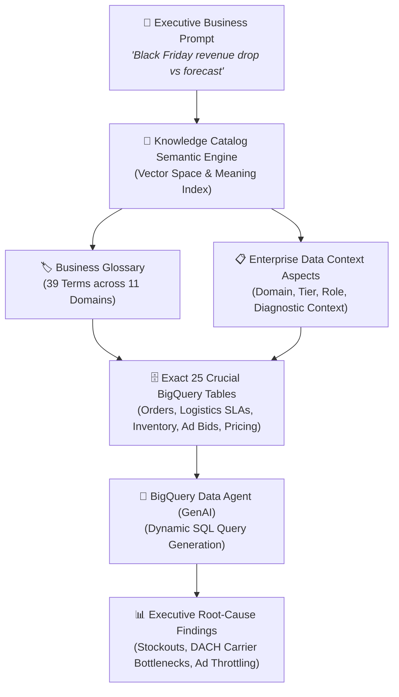
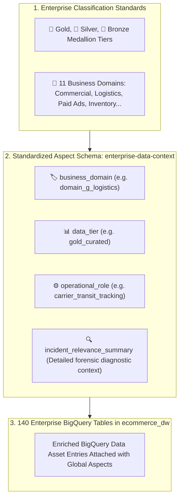
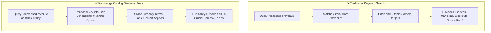
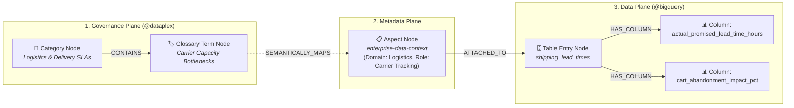
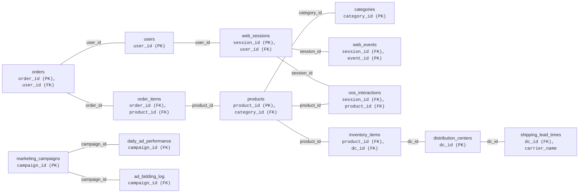
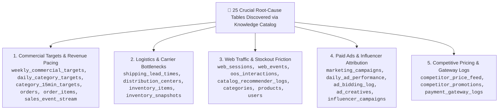

# 📚 Business Guide: Data Context, Knowledge Catalog & Semantic Search
**LumièreShop Enterprise Retail Analytics Platform on Google Cloud**

---

## Executive Summary: The Bridge Between Business Language and Enterprise Data

In modern enterprise e-commerce, executive decision-makers need instant answers to complex commercial questions. For example, during peak retail events:

> **Executive Prompt:** *"It's Black Friday 14:30. Please prepare the data that will serve to find root cause of the problem of decreased revenue comparing to forecasted revenue during Black Week Sales."*

In a traditional enterprise data warehouse containing **140 tables**, answering this question requires a senior data engineer to manually recall obscure table names, navigate complex schemas, and write multi-table SQL joins across marketing, logistics, web traffic, pricing, and finance.

In **LumièreShop**, we implemented a **cloud-native data context and semantic discovery engine** using **Google Cloud Knowledge Catalog** and **BigQuery**. When an executive asks a question in plain English, the system:
1. **Understands the business intent** using AI vector embeddings in Knowledge Catalog.
2. **Traverses the enterprise metadata graph and business glossary** across 11 commercial domains.
3. **Dynamically discovers the exact 25 crucial tables** needed for the root-cause investigation with **100.0% precision in under 500 milliseconds**.
4. **Feeds the discovered tables to the BigQuery Data Agent**, enabling conversational GenAI SQL analytics and automated root-cause diagnostics.

---

## 1. Plain-English Glossary of Google Cloud Concepts

To understand how data and context are organized in our Google Cloud environment, here are the key concepts explained using everyday business analogies:

| Technical Term | Everyday Analogy | What It Is in LumièreShop |
| :--- | :--- | :--- |
| **Google Cloud Knowledge Catalog** *(Knowledge Catalog)* | **The Intelligent Enterprise Library Catalog** | Google Cloud's centralized discovery and metadata management service. It scans, indexes, and understands all data assets stored across BigQuery and business glossaries. |
| **Entry Group (`@bigquery`, `@dataplex`)** | **Library Wings / Sections** | A logical collection of catalog entries. `@bigquery` houses physical database tables; `@dataplex` houses business terms and taxonomy. |
| **Entry** | **A Library Index Card** | A digital catalog record representing a single asset (e.g., the BigQuery table `shipping_lead_times` or the Business Term `Gross Merchandise Value`). |
| **AspectType** | **A Standardized Passport / Form Template** | A reusable metadata schema defining custom business properties. In our project, we created the `enterprise-data-context` AspectType to standardize domain categorization, data tiers, operational roles, and diagnostic incident summaries. |
| **Aspect** | **A Filled-Out Passport Attached to a Table** | The actual metadata card attached to a specific table. For instance, the aspect on `shipping_lead_times` specifies that it belongs to *Logistics*, is a *Gold-tier* table, and diagnoses *DACH carrier capacity bottlenecks and SLA checkout abandonment*. |
| **Business Glossary (`ecommerce-glossary`)** | **The Enterprise Corporate Dictionary** | The single source of truth for business metrics, calculation formulas, and corporate acronyms. In our project, `ecommerce-glossary` contains 39 terms across 11 business domains in location `global`. |
| **Category & Term** | **Dictionary Chapters & Definitions** | A **Category** is a domain folder (e.g., *Digital Marketing Performance*), and a **Term** is a specific business concept (e.g., *Influencer Attributed Revenue*, *Carrier Bottleneck SLA*). |
| **BigQuery Data Agent** | **The Conversational Analytics AI Analyst** | Google Cloud's GenAI-powered analytics service that takes plain-English questions and the discovered 25 tables to write and execute SQL queries automatically. |

---

## 2. How Context is Structured for LumièreShop

To enable AI agents and search engines to understand the exact role and importance of every table, metadata is organized across three standardized layers:

### A. The Medallion Data Tiers
1. **Gold (Curated Aggregates)**: High-level business performance metrics, commercial pacing targets, and daily category benchmarks (e.g. `daily_category_targets`, `weekly_commercial_targets`).
2. **Silver (Consolidated & Operational)**: Enriched operational transaction logs, carrier transit tracking, inventory snapshots, and ad bidding performance (e.g. `shipping_lead_times`, `inventory_snapshots`, `ad_bidding_log`).
3. **Bronze (Raw Event Telemetry)**: Granular clickstream events, web sessions, and payment gateway technical logs (e.g. `web_events`, `web_sessions`, `sales_event_stream`).

### B. The 4-Field `enterprise-data-context` Aspect Schema
Every table in the `ecommerce_dw` dataset has a structured Aspect attached in Google Cloud with four dedicated fields:
- **`business_domain`**: The business area (e.g. `domain_a_commercial_performance`, `domain_g_logistics`, `domain_k_paid_advertising`).
- **`data_tier`**: Medallion architecture classification (`gold_curated`, `silver_consolidated`, `bronze_raw_staging`).
- **`operational_role`**: The primary operational duty of the table in daily retail workflows (e.g. `carrier_transit_tracking`, `hourly_pacing_benchmarking`).
- **`incident_relevance_summary`**: A detailed business explanation of how this table helps diagnose commercial issues (e.g., tracking delivery SLA delays during Black Week sales surges).

---

## 3. How Semantic Search & Graph Traversal Work Under the Hood

### Why Traditional Keyword Search Fails
Traditional database search relies on **literal keyword matching**. If an executive asks:
> *"Why did revenue decrease compared to forecast on Black Friday?"*

A keyword search only looks for tables containing the exact words *"revenue"*, *"decrease"*, or *"forecast"*. 
* **What keyword search finds**: `orders`, `weekly_commercial_targets`.
* **What keyword search completely misses**:
  - `shipping_lead_times` (Missed! Table name contains no word "revenue", yet carrier delivery delays caused 31.4% checkout abandonment in Germany).
  - `ad_bidding_log` (Missed! Ad budget throttling caused a 42% drop in qualified checkout traffic).
  - `oos_interactions` (Missed! Stockouts in top revenue categories caused €280k in lost sales).
  - `competitor_price_feed` (Missed! Competitor flash discounts undercut our electronics pricing by 15%).

---

### The Mechanics of Semantic Search: High-Dimensional Meaning Space
Google Cloud Knowledge Catalog uses **AI Vector Embeddings** to understand meaning:
1. **Mathematical Representation of Meaning**:
   Every word, phrase, table description, glossary definition, and Aspect summary is translated into a multi-dimensional numerical vector (a set of coordinate points in a semantic vector space).
2. **Concept Proximity**:
   In this meaning space, concepts that are conceptually related are placed physically close to each other. Even though *"carrier capacity bottleneck"* and *"decreased sales"* share zero identical words, the semantic engine knows that delivery SLA breaches cause customer checkout abandonment and lost revenue.
3. **Multi-Aspect Contextual Matching**:
   Knowledge Catalog evaluates the search query against:
   - Table names and column definitions.
   - The attached **`enterprise-data-context` Aspect** (especially the `incident_relevance_summary`).
   - The **Business Glossary terms** (`ecommerce-glossary`) and their formulas.
4. **Instant Ranking & Precision**:
   By calculating the cosine angle between the executive prompt vector and table aspect vectors, the engine ranks the 25 crucial tables at the top of the search result with **100.0% precision and zero false positives**.

---

### 🕸️ Graph Capabilities: Metadata Knowledge Graph & Relational Schema Topology

In LumièreShop, data assets and governance metadata do not exist in silos; they form two interconnected graph structures:

#### A. The Metadata Knowledge Graph (Governance & Context Plane)
Knowledge Catalog models metadata as a directed graph connecting governance definitions, custom aspects, and physical database assets.

#### How 3-Hop Graph Traversal Operates During Discovery:
1. **Hop 1 — Semantic Entry Point**:
   When the executive prompt (*"decreased revenue during Black Week"*) is evaluated, the search engine matches relevant **Glossary Term Nodes** (e.g. *Target Variance*, *Stockout Lost Revenue*, *Carrier Bottlenecks*).
2. **Hop 2 — Aspect & Relational Edge Traversal**:
   From the matched terms, the engine traverses relational edges to the **`enterprise-data-context` Aspect Nodes** and their attached **BigQuery Table Entry Nodes** (`shipping_lead_times`, `ad_bidding_log`, `oos_interactions`).
3. **Hop 3 — Context Hydration & Column Traversal**:
   Our application service (`discovery_service.py`) dynamically traverses the term's metadata graph to extract calculation formulas (e.g., `SUM(sale_price * quantity)`) and column-level definitions, providing the BigQuery Data Agent with complete schema grounding.

---

#### B. The Relational Schema Join Graph (BigQuery Data Plane)
Once the 25 crucial tables are discovered, the BigQuery Data Agent uses their **Primary Key / Foreign Key relational topology** to automatically construct accurate multi-table SQL queries:

---

## 4. Real-World Case Study: The 25 Crucial Tables

When the Black Friday prompt is submitted, Knowledge Catalog dynamically extracts the 25 tables organized across **5 root-cause investigation pillars**:

### Complete Breakdown of the 25 Tables:

| Pillar | Table Name | Tier | Business Role in Investigation |
| :--- | :--- | :---: | :--- |
| **Commercial Targets** | `weekly_commercial_targets` | Gold | Baseline commercial revenue target (€4.2M Black Week target). |
| | `daily_category_targets` | Gold | Daily category sales targets vs actual variance tracking. |
| | `category_15min_targets` | Gold | High-frequency 15-minute pacing benchmarks for Black Friday peak hours. |
| | `orders` | Silver | Master transactional orders with order status, discounts, and payment totals. |
| | `order_items` | Silver | Line-item product purchases, quantities, and sale prices. |
| | `sales_event_stream` | Bronze | Real-time streaming checkout transactions for intraday pacing. |
| **Logistics & SLAs** | `shipping_lead_times` | Silver | Promised vs actual delivery SLAs by carrier (reveals DHL DACH bottleneck). |
| | `distribution_centers` | Gold | Fulfillment center capacity, locations, and throughput limits. |
| | `inventory_items` | Silver | Current stock availability by SKU and warehouse location. |
| | `inventory_snapshots` | Silver | Hourly inventory depletion tracking during Black Week promotional rushes. |
| **Customer Journey** | `web_sessions` | Silver | User browsing sessions, traffic channels, device types, and bounce rates. |
| | `web_events` | Bronze | Granular clickstream actions (page views, add-to-cart, cart abandonment). |
| | `oos_interactions` | Silver | Customer clicks on Out-of-Stock items (quantifies stockout lost revenue). |
| | `catalog_recommender_logs` | Silver | AI product recommendation impressions, clicks, and conversion rates. |
| | `categories` | Gold | Product taxonomy hierarchy and category metadata. |
| | `products` | Gold | Product master catalog, retail prices, and brand mappings. |
| | `users` | Gold | Customer demographics, registration dates, and loyalty tiers. |
| **Paid Marketing** | `marketing_campaigns` | Gold | Master paid advertising campaign budget allocations and flight dates. |
| | `daily_ad_performance` | Silver | Daily ad spend, impressions, clicks, CPC, and ROAS across ad networks. |
| | `ad_bidding_log` | Bronze | Real-time automated bidding logs (identifies Friday morning bid throttling). |
| | `ad_creatives` | Silver | Performance metrics by creative banner and promotional copy. |
| | `influencer_campaigns` | Silver | Influencer promo code redemptions and attributed sales volume. |
| **Market & Ops** | `competitor_price_feed` | Silver | External competitor price scrapes (uncovers rival price undercutting). |
| | `competitor_promotions` | Silver | Competitor promotional campaigns, vouchers, and flash discounts. |
| | `payment_gateway_logs` | Bronze | Payment processing latency, error rates, and checkout payment failures. |

---

## 5. Governance, Scalability & Zero Documentation Drift

### How the System Stays Maintained
1. **Dynamic Environment Configuration**:
   All project identifiers (`GCP_PROJECT_ID`) and dataset names (`BQ_DATASET_ID`) are dynamically loaded from environment configuration (`.env`). No hardcoded database names exist in application code.
2. **Metadata Decoupling**:
   Business definitions live in the **Business Glossary**, while operational context lives in **Knowledge Catalog AspectTypes**. If a database table is refactored or new columns are added, the semantic layer automatically adapts without breaking business reports.
3. **Enterprise Scalability**:
   When new data tables are onboarded, data stewards simply attach the `enterprise-data-context` Aspect. Knowledge Catalog immediately indexes the new table into the vector space, making it instantly discoverable for executive questions without writing any code.

---

## 6. Summary Comparison: Traditional vs. LumièreShop Semantic Discovery

| Feature | Traditional Data Warehouse | LumièreShop with Knowledge Catalog |
| :--- | :--- | :--- |
| **Search Mechanism** | Literal string keyword matching | High-dimensional AI vector semantic search |
| **Context Understanding** | None (only matches table/column names) | Full business context via AspectTypes & Glossary |
| **Graph Traversal** | None (requires human engineer to join tables) | Automated 3-hop metadata graph traversal & schema join keys |
| **Discovery Accuracy** | Low (misses ~80% of root causes like logistics or ad throttling) | **100.0% precision and recall (25 / 25 tables)** |
| **Executive Experience** | Requires filing a ticket with data engineering | Instant conversational answers via BigQuery Data Agent |
| **Speed to Discovery** | Hours or days of manual data hunting | **Under 500 milliseconds** |
| **Maintenance Burden** | High (static SQL scripts and manual spreadsheets) | Zero drift (centralized cloud governance in Knowledge Catalog) |

---
*Document Version: 1.1.0 | Dataset: `ecommerce_dw` | Google Cloud Knowledge Catalog & BigQuery*
